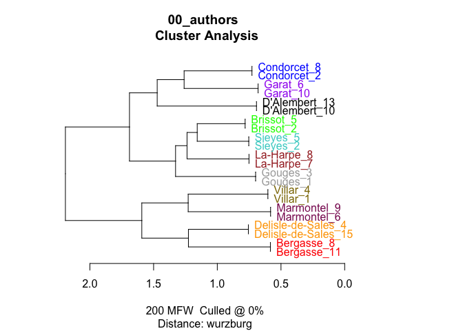
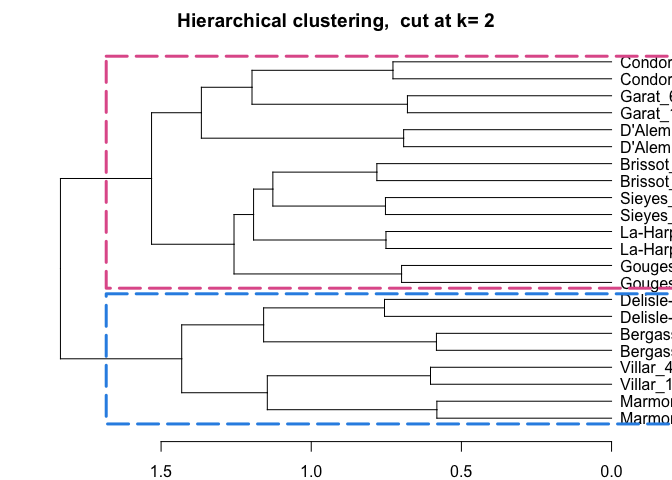
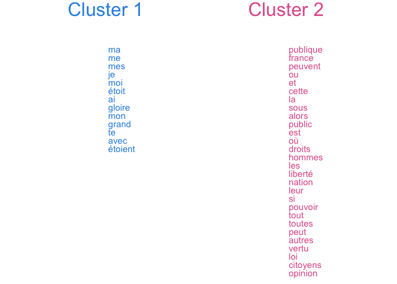
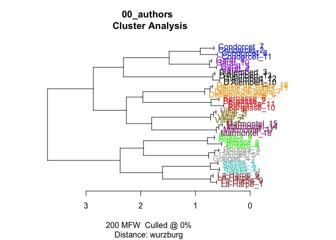
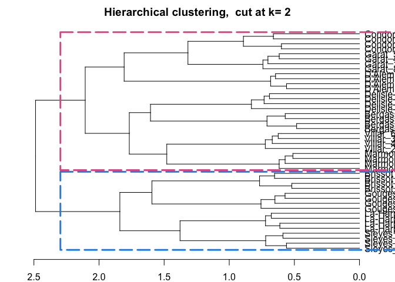
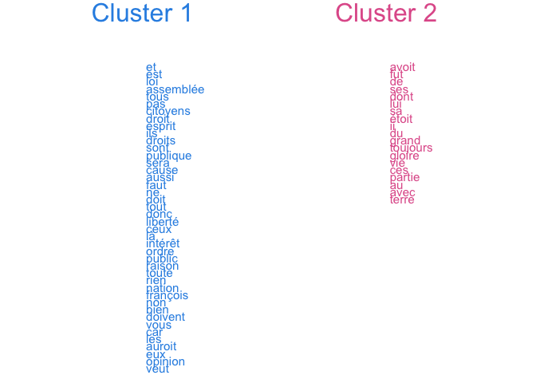
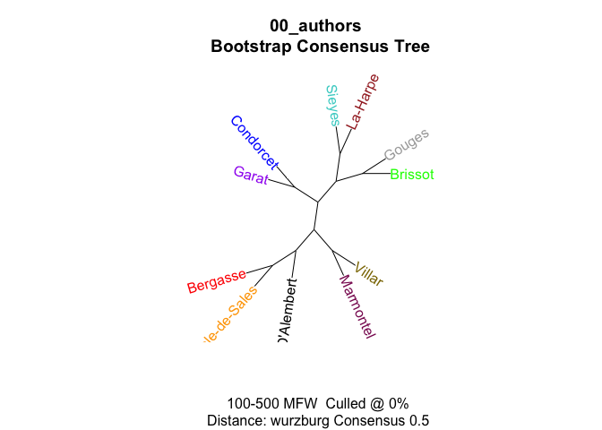
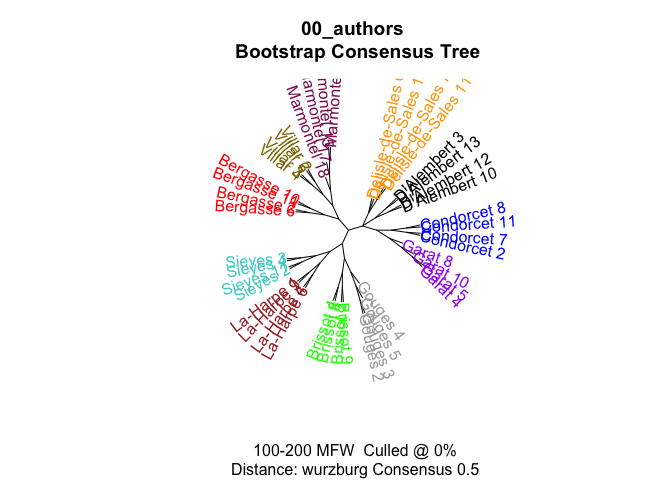

# 00_authors

# Check authors’ inner clusterisation

``` r
library(tidyverse)
library(tidytext)

library(stylo)
library(seetrees)
```

## load data

``` r
fh <- list.files("corpus_authors/", full.names = T)

corpus <- tibble(
  path = fh,
  text = sapply(path, read_file),
  author = str_remove_all(path, "corpus_authors//|\\.txt")
)

glimpse(corpus)
```

    Rows: 11
    Columns: 3
    $ path   <chr> "corpus_authors//Bergasse.txt", "corpus_authors//Brissot.txt", …
    $ text   <chr> "pauvres ils apprendra pas les au enseignement ment action pui …
    $ author <chr> "Bergasse", "Brissot", "Condorcet", "D'Alembert", "Delisle-de-S…

``` r
unique(corpus$author)
```

     [1] "Bergasse"         "Brissot"          "Condorcet"        "D'Alembert"      
     [5] "Delisle-de-Sales" "Garat"            "Gouges"           "La-Harpe"        
     [9] "Marmontel"        "Sieyes"           "Villar"          

## create samples

N tokens for each author:

``` r
corpus %>% 
  unnest_tokens(input = text, output = word, token = "words") %>% 
  count(author, sort = T)
```

    Warning: Outer names are only allowed for unnamed scalar atomic inputs

    # A tibble: 11 × 2
       author               n
       <chr>            <int>
     1 Delisle-de-Sales 45000
     2 D'Alembert       39512
     3 Marmontel        37610
     4 Condorcet        29779
     5 Garat            25168
     6 Sieyes           24810
     7 Bergasse         24034
     8 La-Harpe         22623
     9 Brissot          19745
    10 Villar           12400
    11 Gouges           11423

``` r
sample_size <- 2000
```

``` r
corpus_authors_t <- corpus %>% 
  unnest_tokens(input = text, output = word, token = "words") %>% 
  
  group_by(author) %>% 
  # reshuffle words inside each author
  do(sample_n(., size = nrow(.))) %>%
  
  mutate(sample = ceiling(row_number()/sample_size)) %>% 
  unite(sample_id, c(author, sample), remove = F) %>% 
  filter(sample != max(sample)) %>% 
  ungroup() %>% 
  select(sample_id, author, word, sample)
```

    Warning: Outer names are only allowed for unnamed scalar atomic inputs

``` r
head(corpus_authors_t)
```

    # A tibble: 6 × 4
      sample_id  author   word     sample
      <chr>      <chr>    <chr>     <dbl>
    1 Bergasse_1 Bergasse évidente      1
    2 Bergasse_1 Bergasse il            1
    3 Bergasse_1 Bergasse refte         1
    4 Bergasse_1 Bergasse qui           1
    5 Bergasse_1 Bergasse de            1
    6 Bergasse_1 Bergasse beaucoup      1

## sampling

``` r
print(paste("Total number of full 2000 words samples:",
      corpus_authors_t %>% 
        select(sample_id) %>% pull() %>% unique %>% length))
```

    [1] "Total number of full 2000 words samples: 140"

## function

``` r
sample_indipendent <- function(corpus_tokenised, n_samples, sample_size,
                               text_var = "word", 
                               folder = "corpus_samples_dump/",
                               overwrite = T) {
  
  dir.create(folder)
  
  if(overwrite) {
    do.call(file.remove, list(list.files("corpus_samples_dump/", full.names = TRUE)))
  }
  
    
    seed_samples <- corpus_tokenised %>% 
      select(sample_id, author) %>% 
      distinct() %>% 
      group_by(author) %>% 
      sample_n(n_samples) %>% 
      pull(sample_id)
    
    # create table with 1 row = 1 sample
    true_samples <- corpus_tokenised %>% 
      filter(sample_id %in% seed_samples) %>% 
      group_by(sample_id) %>% 
      summarise(text = paste(!!sym(text_var), collapse = " "))
    
    
    for (i in 1:nrow(true_samples)) {
      write_file(file = paste0(folder, true_samples$sample_id[i], ".txt"),
                 true_samples$text[i])
    }

}
```

## sampling

### 2 samples test

``` r
sample_indipendent(corpus_tokenised = corpus_authors_t,
                   n_samples = 2,
                   sample_size = 2000)
```

    Warning in dir.create(folder): 'corpus_samples_dump' already exists

``` r
test_samples_2 <- stylo(
  gui = F,
  corpus.dir = "corpus_samples_dump/",
               corpus.lang = "Other",
               distance.measure = "wurzburg",
               mfw.min = 200,
               mfw.max = 200
)
```

    using current directory...

    Performing no sampling (using entire text as sample)

    slicing input text into tokens...


    turning words into features, e.g. char n-grams (if applicable)...

    Total nr. of samples in the corpus: 22

    The corpus consists of 44050 tokens

    processing  22  text samples

    ..
    combining frequencies into a table...


    culling @ 0 available features (words) 5000
    Calculating z-scores... 

    MFW used: 
    200 
    Processing metadata...


    Assigning plot colors according to file names...

     



``` r
view_tree(test_samples_2, k = 2, label_size = 4)
```





``` r
test_samples_2$features.actually.used
```


    ------------------------------------------------
    features (e.g. frequent words) actually analyzed 
    ------------------------------------------------

      [1]  de         la         les        le         que        il         
      [7]  des        qu         qui        un         en         est        
     [13]  dans       ne         et         ce         pour       on         
     [19]  du         une        plus       par        pas        se         
     [25]  je         cette      au         vous       lui        sur        
     [31]  si         nous       ses        son        ces        mais       
     [37]  ou         avec       même      sa         leur       ils        
     [43]  sont       elle       tout       être      tous       peut       
     [49]  aux        ont        comme      dont       où        me         
     [55]  fait       sans       bien       faire      leurs      hommes     
     [61]  encore     étoit     homme      toutes     avoir      point      
     [67]  moins      doit       été      ai         autre      autres     
     [73]  peu        ceux       donc       faut       grand      dire       
     [79]  dit        toujours   mon        temps      avoit      deux       
     [85]  peuple     contre     toute      jamais     nos        liberté   
     [91]  rien       entre      esprit     ma         trop       nature     
     [97]  ii         ni         sous       tant       celle      cet        
    [103]  nation     pouvoir    quand      roi        celui      droit      
    [109]  non        parce      principes  elles      jour       moi        
    [115]  soit       eux        france     ainsi      droits     mesmer     
    [121]  seroit     quelques   votre      intérêt  après     mes        
    [127]  quelque    vérité   étoient   frédéric grande     voir       
    [133]  donner     là        loix       société  très      alors      
    [139]  aussi      loi        moment     peuvent    premier    fois       
    [145]  fut        gloire     partie     pourquoi   ré        sera       
    [151]  vie        doute      force      notre      peuples    public     
    [157]  sol        car        cependant  ici        mieux      citoyens   
    [163]  corps      françois  idées     monde      pu         seul       
    [169]  lois       rendre     te         vertus     chaque     eu         
    [175]  nombre     opinion    patrie     publique   trois      vertu      
    [181]  vos        cela       depuis     enfin      mêmes     mille      
    [187]  sens       voit       accord     beaucoup   mal        objet      
    [193]  ordre      prince     yeux       art        faits      gens       
    [199]  ministre   or         

    (total number of elements:  200)

### 4 samples test

``` r
sample_indipendent(corpus_tokenised = corpus_authors_t,
                   n_samples = 4,
                   sample_size = 2000)
```

    Warning in dir.create(folder): 'corpus_samples_dump' already exists

``` r
n_samples = 4

length(unique(corpus_authors_t$author))*4 == (length(list.files(path = "corpus_samples_dump/")))
```

    [1] TRUE

``` r
test_samples_4 <- stylo(
  gui = F,
  corpus.dir = "corpus_samples_dump/",
               corpus.lang = "Other",
               distance.measure = "wurzburg",
               mfw.min = 200,
               mfw.max = 200
)
```

    using current directory...

    Performing no sampling (using entire text as sample)

    slicing input text into tokens...


    turning words into features, e.g. char n-grams (if applicable)...

    Total nr. of samples in the corpus: 44

    The corpus consists of 88091 tokens

    processing  44  text samples

    ....
    combining frequencies into a table...


    culling @ 0 available features (words) 5000
    Calculating z-scores... 

    MFW used: 
    200 
    Processing metadata...


    Assigning plot colors according to file names...

     



``` r
view_tree(test_samples_4, k = 2, label_size = 4)
```





``` r
test_samples_4$features.actually.used
```


    ------------------------------------------------
    features (e.g. frequent words) actually analyzed 
    ------------------------------------------------

      [1]  de         la         les        le         que        il         
      [7]  des        qu         qui        en         un         est        
     [13]  dans       ne         et         on         ce         une        
     [19]  du         pour       plus       par        pas        je         
     [25]  se         sur        au         cette      si         mais       
     [31]  vous       ces        son        nous       ses        sa         
     [37]  lui        ils        même      leur       avec       tout       
     [43]  être      elle       ou         sont       aux        tous       
     [49]  ont        comme      peut       sans       bien       fait       
     [55]  dont       point      leurs      hommes     encore     me         
     [61]  faire      étoit     toutes     où        homme      avoir      
     [67]  deux       peuple     avoit      doit       ai         faut       
     [73]  été      ceux       moins      autre      mon        nature     
     [79]  autres     dit        toute      temps      donc       peu        
     [85]  nos        cet        ni         toujours   contre     grand      
     [91]  soit       celui      rien       sous       jamais     esprit     
     [97]  ii         tant       nation     roi        quelques   votre      
    [103]  là        droit      eux        quand      trop       après     
    [109]  fois       loi        ma         non        société  entre      
    [115]  frédéric liberté   sera       dire       elles      fut        
    [121]  parce      pouvoir    seroit     quelque    celle      mes        
    [127]  moi        ici        notre      france     principes  enfin      
    [133]  grande     publique   ainsi      alors      droits     force      
    [139]  sol        vie        public     amour      état      mesmer     
    [145]  premier    aussi      doute      peuples    très      car        
    [151]  cependant  lois       moment     ordre      voir       vos        
    [157]  intérêt  tiers      beaucoup   donner     mieux      nombre     
    [163]  pu         ré        depuis     partie     corps      étoient   
    [169]  jour       monde      seul       citoyens   patrie     raison     
    [175]  ait        gloire     mêmes     nom        accord     eu         
    [181]  peuvent    auroit     bonheur    assemblée françois  vérité   
    [187]  vers       yeux       doivent    effet      opinion    autant     
    [193]  avons      pourquoi   quel       terre      tu         veut       
    [199]  cause      manière   

    (total number of elements:  200)

## bootstrap test

### all

``` r
test_bootstrap <- stylo(
            gui=F,
            mfw.min=100,
            mfw.max=500,
            mfw.incr = 1,
            analyzed.features = "w",
            ngram.size = 1,
            analysis.type = "BCT",
            consensus.strength = 0.5,
            distance.measure = "wurzburg",
            corpus.dir="corpus_authors/",
            corpus.lang="Other"
)
```



### samples

``` r
bct_words <- stylo(
            gui=F,
            mfw.min=100,
            mfw.max=200,
            mfw.incr = 1,
            analyzed.features = "w",
            ngram.size = 1,
            analysis.type = "BCT",
            consensus.strength = 0.5,
            distance.measure = "wurzburg",
            corpus.dir="corpus_samples_dump/",
            corpus.lang="Other"
            )
```


