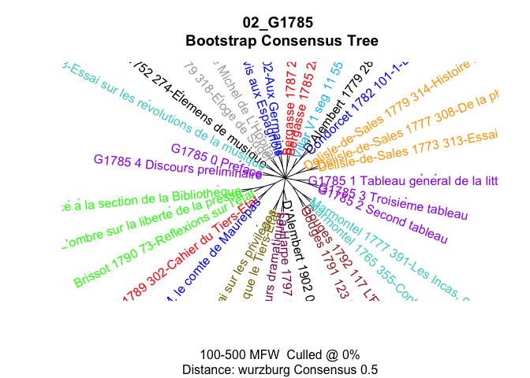

# 02_G1785

# Authorship of the introductory texts in Galerie 1785

### load packages

``` r
library(tidyverse)
library(tidytext)

library(stylo)
library(seetrees)

set.seed(1234)
```

## Quick book-based exploration

### write data

``` r
fh <- list.files(path = "../../corpus_texts/", full.names = T)

corpus <- tibble(
  path = fh,
  text = sapply(path, read_file),
  id = str_remove_all(path, "\\.\\./\\.\\./corpus_texts//|\\.txt"),
  path_new = str_remove_all(path, "^\\.\\./\\.\\./")
) %>% 
  filter(!str_detect(id, "^G1787")) # remove texts from 1787 volumes

glimpse(corpus)
```

Write texts for easier stylo use

``` r
for (i in 1:nrow(corpus)) {
  write_file(corpus$text[i], file = corpus$path_new[i])
}
```

### stylo - quick tests

#### 200 mfw

``` r
test_00 <- stylo(
  gui = F,
  corpus.dir = "corpus_texts/", # given that texts are already created
  corpus.lang = "Other",
  analysed.features = "w",
  mfw.min = 200,
  mfw.max = 200,
  distance.measure = "wurzburg"
)
```

    using current directory...

    Performing no sampling (using entire text as sample)

    slicing input text into tokens...


    turning words into features, e.g. char n-grams (if applicable)...

    Total nr. of samples in the corpus: 33

    The corpus consists of 708978 tokens

    processing  33  text samples

    ...
    combining frequencies into a table...


    culling @ 0 available features (words) 5000
    Calculating z-scores... 

    MFW used: 
    200 
    Processing metadata...


    Assigning plot colors according to file names...

     


``` r
view_tree(test_00, k = 2, label_size = 4)
```


#### bootstrap

``` r
bct <- stylo(
  gui = F,
  mfw.min = 100,
  mfw.max = 500,
  mfw.incr = 1,
  analysed.features = "w",
  ngram.size = 1,
  analysis.type = "BCT",
  consensus.strength = 0.5,
  distance.measure = "wurzburg",
  corpus.dir = "corpus_texts/",
  corpus.lang = "Other"
)
```



``` r
rm(bct, test_00, corpus, fh)
```

    Warning in rm(bct, test_00, corpus, fh): object 'corpus' not found

    Warning in rm(bct, test_00, corpus, fh): object 'fh' not found

# Authors’ samples & sampling

## create data

``` r
fh_authors <- list.files(path = "../../corpus_authors/", 
                 full.names = T)

fh_q <- list.files(path = "../../corpus_texts/",
                   pattern = "^G1785",
                   full.names = T)

fh <- c(fh_authors, fh_q)
rm(fh_authors, fh_q)

corpus <- tibble(
  path = fh,
  text = sapply(path, read_file)
) %>% 
  mutate(author = str_remove_all(path, "\\.\\./\\.\\./.*?//|\\.txt"),
         path_new = str_remove_all(path, "\\.\\./\\.\\./.*?//"),
         path_new = paste0("corpus_authors//", path_new)) 

glimpse(corpus)
unique(corpus$author)
unique(corpus$path_new)
```

### save

``` r
for (i in 1:nrow(corpus)) {
  write_file(corpus$text[i], file = corpus$path_new[i])
}
```

## load data

``` r
fh <- list.files(path = "corpus_authors/",
                 full.names = T)

corpus <- tibble(
  path = fh,
  text = sapply(path, read_file)
) %>% 
  mutate(author = str_remove_all(path, "corpus_authors//|\\.txt")) 

glimpse(corpus)
```

    Rows: 16
    Columns: 3
    $ path   <chr> "corpus_authors//Bergasse.txt", "corpus_authors//Brissot.txt", …
    $ text   <chr> "pauvres ils apprendra pas les au enseignement ment action pui …
    $ author <chr> "Bergasse", "Brissot", "Condorcet", "D'Alembert", "Delisle-de-S…

### corpus_size

``` r
corpus %>% 
  unnest_tokens(input = text, output = word, token = "words") %>% 
  count(author, sort = T)
```

    Warning: Outer names are only allowed for unnamed scalar atomic inputs

    # A tibble: 16 × 2
       author                                        n
       <chr>                                     <int>
     1 Delisle-de-Sales                          45000
     2 D'Alembert                                39512
     3 Marmontel                                 37610
     4 Condorcet                                 29779
     5 Garat                                     25168
     6 Sieyes                                    24810
     7 Bergasse                                  24034
     8 La-Harpe                                  22623
     9 Brissot                                   19745
    10 G1785_1_Tableau général de la littérature 13404
    11 Villar                                    12400
    12 Gouges                                    11423
    13 G1785_3_Troisième tableau                  8465
    14 G1785_0_Préface                            7560
    15 G1785_2_Second tableau                     6350
    16 G1785_4_Discours préliminaire              3670

## Exploration

### mfw 200

``` r
test_200mfw <- stylo(
  gui = F,
  mfw.min = 200,
  mfw.max = 200,
  analyzed.features = "w",
  distance.measure = "wurzburg",
  corpus.dir = "corpus_authors/",
  corpus.lang = "Other"
  )
```

    using current directory...

    Performing no sampling (using entire text as sample)

    slicing input text into tokens...


    turning words into features, e.g. char n-grams (if applicable)...

    Total nr. of samples in the corpus: 16

    The corpus consists of 331869 tokens

    processing  16  text samples

    .
    combining frequencies into a table...


    culling @ 0 available features (words) 5000
    Calculating z-scores... 

    MFW used: 
    200 
    Processing metadata...


    Assigning plot colors according to file names...

     


### bootstrap, all

``` r
bct_all <- stylo(
  gui = F,
  mfw.min = 100,
  mfw.max = 500,
  mfw.incr = 1,
  analyzed.features = "w",
  ngram.size = 1,
  analysis.type = "BCT",
  distance.measure = "wurzburg",
  corpus.dir = "corpus_authors/",
  corpus.lang = "Other"
)
```


## Sampling

### function

``` r
sample_independent <- function(corpus,
                               sample_size,
                               n_samples,
                               text_var = "word",
                               folder = "corpus_samples_dump/",
                               overwrite = T) {
  
  # 0 create/rewrite folder
  dir.create(folder)
  
  if(overwrite) {
    do.call(file.remove, list(
      list.files("corpus_samples_dump/", full.names = TRUE))
      )
  }
  
  # I tokenization & ceiling
  
  corpus_tokenized <- corpus %>% 
    unnest_tokens(input = text, output = word, token = "words") %>% 
    
    group_by(author) %>% 
    # reshuffle words inside each author
    do(sample_n(., size = nrow(.))) %>%
    
    mutate(sample = ceiling(row_number()/sample_size)) %>% 
    unite(sample_id, c(author, sample), remove = F) %>% 
    filter(sample != max(sample)) %>% 
    ungroup() %>% 
    select(sample_id, author, word, sample)
  
  # II set seeds
  seed_samples <- corpus_tokenized %>% 
      select(sample_id, author) %>% 
      distinct() %>% 
      group_by(author) %>% 
      sample_n(n_samples) %>% 
      pull(sample_id)
  
  ### III create table with 1 row = 1 sample
    true_samples <- corpus_tokenized %>% 
      filter(sample_id %in% seed_samples) %>% 
      group_by(sample_id) %>% 
      summarise(text = paste(!!sym(text_var), collapse = " "))
    
    
  ### IV write samples in the folder
    for (i in 1:nrow(true_samples)) {
      write_file(file = paste0(folder, true_samples$sample_id[i], ".txt"),
                 true_samples$text[i])
    }
  
}
```

### test samples

#### 100 mfw

``` r
sample_independent(corpus = corpus,
                   sample_size = 1800,
                   n_samples = 2)
```

    Warning in dir.create(folder): 'corpus_samples_dump' already exists

    Warning: Outer names are only allowed for unnamed scalar atomic inputs

``` r
test_samples_0 <- stylo(gui=F,
            mfw.min=100,
            mfw.max=100,
            analyzed.features = "w",
            ngram.size = 1,
            distance.measure = "wurzburg",
            #number.of.samples=2,
            corpus.lang="Other",
            corpus.dir="corpus_samples_dump/")
```


``` r
view_tree(test_samples_0, k = 2, label_size = 4)
```


``` r
test_samples_0$features.actually.used
```


    ------------------------------------------------
    features (e.g. frequent words) actually analyzed 
    ------------------------------------------------

      [1]  de        la        les       le        des       que       il        
      [8]  en        qui       dans      qu        un        est       on        
     [15]  ne        du        une       pour      plus      ce        et        
     [22]  par       se        pas       nous      au        sur       cette     
     [29]  ils       je        même     leur      son       mais      avec      
     [36]  être     sont      lui       aux       ces       ses       si        
     [43]  ou        elle      sa        tous      vous      comme     ont       
     [50]  tout      étoit    leurs     sans      dont      peut      fait      
     [57]  langue    bien      faire     encore    hommes    point     où       
     [64]  temps     avoir     homme     me        été     avoit     toutes    
     [71]  nos       ceux      moins     peuple    autres    doit      autre     
     [78]  toujours  sous      latin     deux      lettres   peu       dit       
     [85]  celle     grand     après    alors     fut       cet       donc      
     [92]  nature    toute     ni        quand     contre    mon       nation    
     [99]  notre     tant      

    (total number of elements:  100)

#### 200 mfw

``` r
sample_independent(corpus = corpus,
                   sample_size = 1800,
                   n_samples = 2)
```

    Warning in dir.create(folder): 'corpus_samples_dump' already exists

    Warning: Outer names are only allowed for unnamed scalar atomic inputs

``` r
test_samples_1 <- stylo(gui=F,
            mfw.min=200,
            mfw.max=200,
            analyzed.features = "w",
            ngram.size = 1,
            distance.measure = "wurzburg",
            #number.of.samples=2,
            corpus.lang="Other",
            corpus.dir="corpus_samples_dump/")
```


``` r
view_tree(test_samples_1, k = 2, label_size = 4)
```


``` r
test_samples_1$features.actually.used
```


    ------------------------------------------------
    features (e.g. frequent words) actually analyzed 
    ------------------------------------------------

      [1]  de         la         les        le         des        que        
      [7]  il         qui        en         qu         dans       un         
     [13]  est        on         pour       ne         une        du         
     [19]  plus       ce         par        et         pas        se         
     [25]  au         ils        cette      mais       nous       sur        
     [31]  ces        je         leur       ses        si         son        
     [37]  sont       même      lui        avec       tout       tous       
     [43]  vous       ont        être      ou         aux        elle       
     [49]  sa         étoit     comme      sans       leurs      langue     
     [55]  dont       peut       fait       bien       faire      où        
     [61]  encore     point      avoit      hommes     avoir      toutes     
     [67]  homme      temps      autres     nos        ceux       moins      
     [73]  me         doit       été      peu        peuple     toujours   
     [79]  sous       autre      celle      faut       cet        parce      
     [85]  après     ai         dire       lettres    deux       latin      
     [91]  donc       grand      contre     depuis     ni         notre      
     [97]  trop       entre      non        tant       société  elles      
    [103]  grande     liberté   fut        france     jamais     nation     
    [109]  nature     droit      peuples    quelques   étoient   mon        
    [115]  toute      premier    quand      soit       dit        enfin      
    [121]  vie        eux        loi        rien       ii         loix       
    [127]  mêmes     voir       alors      celui      intérêt  langage    
    [133]  opinion    françois  gaules     nombre     voit       donner     
    [139]  gaulois    long       public     état      fois       là        
    [145]  génie     mots       ordre      sera       avoient    eu         
    [151]  ma         manière   partie     sciences   gens       jour       
    [157]  très      vers       car        pouvoir    ufage      anciens    
    [163]  chez       auroit     aussi      droits     louis      monde      
    [169]  principes  roi        fiècle    force      moi        quelque    
    [175]  rendre     seroit     vos        cela       esprit     gloire     
    [181]  grands     mesmer     nom        saint      votre      arts       
    [187]  aujourd    autant     mes        pays       peuvent    tems       
    [193]  ainfi      auteur     effet      fit        hui        ici        
    [199]  livres     quel       

    (total number of elements:  200)

### bct samples

``` r
bct_samples <- stylo(
            gui=F,
            mfw.min=100,
            mfw.max=200,
            mfw.incr = 1,
            analyzed.features = "w",
            ngram.size = 1,
            analysis.type = "BCT",
            consensus.strength = 0.5,
            distance.measure = "wurzburg",
            corpus.dir="corpus_samples_dump/",
            corpus.lang="Other"
            )
```


## Larger samples

Remove the smallest text G1785_4

``` r
corpus %>% 
  unnest_tokens(input = text, output = word, token = "words") %>% 
  count(author, sort = T)
```

    Warning: Outer names are only allowed for unnamed scalar atomic inputs

    # A tibble: 16 × 2
       author                                        n
       <chr>                                     <int>
     1 Delisle-de-Sales                          45000
     2 D'Alembert                                39512
     3 Marmontel                                 37610
     4 Condorcet                                 29779
     5 Garat                                     25168
     6 Sieyes                                    24810
     7 Bergasse                                  24034
     8 La-Harpe                                  22623
     9 Brissot                                   19745
    10 G1785_1_Tableau général de la littérature 13404
    11 Villar                                    12400
    12 Gouges                                    11423
    13 G1785_3_Troisième tableau                  8465
    14 G1785_0_Préface                            7560
    15 G1785_2_Second tableau                     6350
    16 G1785_4_Discours préliminaire              3670

``` r
corpus_l <- corpus %>% 
  filter(author != "G1785_4_Discours préliminaire")
```

### test samples

#### 3 samples, 2k words

``` r
sample_independent(corpus = corpus_l,
                   sample_size = 3000,
                   n_samples = 2)
```

    Warning in dir.create(folder): 'corpus_samples_dump' already exists

    Warning: Outer names are only allowed for unnamed scalar atomic inputs

``` r
test_samples_2 <- stylo(gui=F,
            mfw.min=200,
            mfw.max=200,
            analyzed.features = "w",
            ngram.size = 1,
            distance.measure = "wurzburg",
            #number.of.samples=2,
            corpus.lang="Other",
            corpus.dir="corpus_samples_dump/")
```

    using current directory...

    Performing no sampling (using entire text as sample)

    slicing input text into tokens...


    turning words into features, e.g. char n-grams (if applicable)...

    Total nr. of samples in the corpus: 30

    The corpus consists of 90072 tokens

    processing  30  text samples

    ...
    combining frequencies into a table...


    culling @ 0 available features (words) 5000
    Calculating z-scores... 

    MFW used: 
    200 
    Processing metadata...


    Assigning plot colors according to file names...

     


``` r
view_tree(test_samples_2, k = 2, label_size = 4)
```


``` r
test_samples_2$features.actually.used
```


    ------------------------------------------------
    features (e.g. frequent words) actually analyzed 
    ------------------------------------------------

      [1]  de         la         les        le         des        que        
      [7]  il         qui        en         qu         dans       un         
     [13]  est        on         pour       ne         du         une        
     [19]  ce         plus       et         par        pas        se         
     [25]  au         nous       cette      je         sur        mais       
     [31]  ils        ces        si         ses        son        même      
     [37]  leur       ou         sa         lui        tout       elle       
     [43]  sont       ont        aux        avec       tous       comme      
     [49]  vous       langue     étoit     dont       sans       être      
     [55]  bien       peut       leurs      fait       où        encore     
     [61]  faire      point      hommes     toutes     temps      autres     
     [67]  me         avoir      nos        avoit      ceux       été      
     [73]  moins      homme      doit       dit        deux       peu        
     [79]  sous       donc       ni         peuple     autre      latin      
     [85]  fut        toujours   elles      eux        faut       cet        
     [91]  grand      nature     toute      jamais     ai         lettres    
     [97]  là        mon        celle      quelques   françois  après     
    [103]  contre     tant       entre      dire       notre      quand      
    [109]  soit       roi        droit      celui      nation     non        
    [115]  étoient   parce      rien       depuis     partie     alors      
    [121]  ii         trop       gaulois    sera       esprit     seroit     
    [127]  voir       moi        nom        société  loix       nombre     
    [133]  fois       france     mêmes     pouvoir    premier    langage    
    [139]  loi        vie        vos        votre      enfin      peuples    
    [145]  principes  aussi      donner     grands     ma         avoient    
    [151]  gens       quelque    cependant  frédéric hui        long       
    [157]  mieux      pays       très      vers       état      fiècle    
    [163]  ici        monde      grande     ufage      génie     voit       
    [169]  louis      sciences   vérité   eu         gaules     mots       
    [175]  jour       liberté   ouvrage    première  pu         aujourd    
    [181]  auroit     corps      doute      force      mes        ait        
    [187]  autant     beaucoup   car        manière   moment     parler     
    [193]  public     rendre     arts       fit        gloire     peuvent    
    [199]  sol        droits     

    (total number of elements:  200)

# Remove words

Filter out topic-related words

``` r
glimpse(corpus)
```

    Rows: 16
    Columns: 3
    $ path   <chr> "corpus_authors//Bergasse.txt", "corpus_authors//Brissot.txt", …
    $ text   <chr> "pauvres ils apprendra pas les au enseignement ment action pui …
    $ author <chr> "Bergasse", "Brissot", "Condorcet", "D'Alembert", "Delisle-de-S…

Select words based on the features above

``` r
signal_words <- paste0(c("^langue", "^latin", "^fut", "liberté",
                  "^gaule", "^lettre", "^hui$",
                  "^gaulois", "^language", "^ainfi", "^ainsi",
                  "^louis$", "^mesmer$", "frédéric",
                  "^génie", 
                  "^loi","^ancien", "^roi$",
                  "^liberté$", "^france$", "^francois",
                  
                  "^je$", "^ma$", "^mon$", "^moi$",
                  "^vous$", "^vos$", "^votre$"
                  ),
                  collapse = "|"
                  )
```

Write 1 text = 1 row

``` r
corpus_filtered <- corpus %>% 
  unnest_tokens(input = text, output = word, token = "words") %>% 
  mutate(word = str_replace_all(word, "^ufage$", "usage"),
         word = str_replace_all(word, "^fiècle", "siècle")) %>% 
  filter(!str_detect(word, signal_words))
```

    Warning: Outer names are only allowed for unnamed scalar atomic inputs

### n tokens after filter

``` r
nrow(corpus_filtered)
```

    [1] 323687

``` r
corpus_filtered %>% 
  count(author, sort = T)
```

    # A tibble: 16 × 2
       author                                        n
       <chr>                                     <int>
     1 Delisle-de-Sales                          44144
     2 D'Alembert                                39149
     3 Marmontel                                 36079
     4 Condorcet                                 29305
     5 Garat                                     24732
     6 Sieyes                                    24361
     7 Bergasse                                  23169
     8 La-Harpe                                  22181
     9 Brissot                                   19376
    10 G1785_1_Tableau général de la littérature 13101
    11 Villar                                    12016
    12 Gouges                                    10962
    13 G1785_3_Troisième tableau                  8037
    14 G1785_0_Préface                            7438
    15 G1785_2_Second tableau                     6010
    16 G1785_4_Discours préliminaire              3627

``` r
corpus_filtered %>% 
  filter(word == "ufage")
```

    # A tibble: 0 × 3
    # ℹ 3 variables: path <chr>, author <chr>, word <chr>

``` r
corpus_filtered <- corpus_filtered %>% 
  group_by(author) %>% 
  mutate(text = paste(word, collapse = " ")) %>% 
  ungroup() %>% 
  select(-word) %>% 
  distinct()

glimpse(corpus_filtered)
```

    Rows: 16
    Columns: 3
    $ path   <chr> "corpus_authors//Bergasse.txt", "corpus_authors//Brissot.txt", …
    $ author <chr> "Bergasse", "Brissot", "Condorcet", "D'Alembert", "Delisle-de-S…
    $ text   <chr> "pauvres ils apprendra pas les au enseignement ment action pui …

## sampling

``` r
sample_independent(corpus = corpus_filtered,
                   sample_size = 1800,
                   n_samples = 2)
```

    Warning in dir.create(folder): 'corpus_samples_dump' already exists

## tests

### 100 mfw

``` r
test_filtered_100 <- stylo(
  gui = F,
  mfw.min = 100,
  mfw.max = 100,
  analyzed.features = "w",
  distance.measure = "wurzburg",
  corpus.dir = "corpus_samples_dump/",
  corpus.lang = "Other"
)
```


``` r
test_filtered_200 <- stylo(
  gui = F,
  mfw.min = 200,
  mfw.max = 200,
  analyzed.features = "w",
  distance.measure = "wurzburg",
  corpus.dir = "corpus_samples_dump/",
  corpus.lang = "Other"
)
```


``` r
view_tree(test_filtered_200, k = 2, label_size = 4)
```


``` r
test_filtered_200$features.actually.used
```


    ------------------------------------------------
    features (e.g. frequent words) actually analyzed 
    ------------------------------------------------

      [1]  de         la         les        le         des        que        
      [7]  en         il         qui        qu         un         dans       
     [13]  est        on         ne         du         pour       plus       
     [19]  une        ce         et         par        pas        se         
     [25]  nous       au         ils        mais       cette      sur        
     [31]  leur       son        même      ces        ses        si         
     [37]  sont       tout       elle       lui        tous       ou         
     [43]  avec       sa         comme      être      ont        étoit     
     [49]  aux        leurs      sans       peut       dont       fait       
     [55]  encore     point      où        bien       faire      nos        
     [61]  hommes     homme      temps      autres     été      moins      
     [67]  ceux       avoit      doit       toutes     avoir      me         
     [73]  après     cet        peuple     sous       toujours   autre      
     [79]  deux       grand      donc       faut       notre      toute      
     [85]  françois  nation     celle      ni         ai         depuis     
     [91]  dire       eux        là        peu        alors      rien       
     [97]  trop       siècle    tant       celui      elles      étoient   
    [103]  nature     quelques   ii         jamais     parce      quelque    
    [109]  société  dit        nombre     contre     grande     soit       
    [115]  entre      quand      sciences   sera       voir       vie        
    [121]  mêmes     seroit     avoient    esprit     sol        vers       
    [127]  donner     enfin      premier    fois       monde      nom        
    [133]  droit      peuples    principes  jour       mieux      mots       
    [139]  non        usage      arts       pouvoir    très      amour      
    [145]  car        langage    parler     partie     vérité   beaucoup   
    [151]  état      gens       pu         public     saint      aucun      
    [157]  avant      force      grands     ici        mes        trois      
    [163]  autant     doute      eu         moment     seul       tems       
    [169]  donné     long       pays       rendre     bonheur    citoyens   
    [175]  fit        ouvrages   publique   siècles   aussi      avons      
    [181]  cela       celtique   intérêt  livres     mi         ouvrage    
    [187]  aujourd    auroit     cependant  doivent    droits     furent     
    [193]  mal        premiers   veut       voit       ans        genre      
    [199]  goût      jufqu      

    (total number of elements:  200)

``` r
test_filtered_bct <- stylo(
            gui=F,
            mfw.min=50,
            mfw.max=200,
            mfw.incr = 1,
            analyzed.features = "w",
            ngram.size = 1,
            analysis.type = "BCT",
            consensus.strength = 0.5,
            distance.measure = "wurzburg",
            corpus.dir="corpus_samples_dump/",
            corpus.lang="Other"
)
```


# Distribution of distances

Replication from navalny.R
https://github.com/perechen/navalny_R/blob/main/stylometry_navalny.md

## functions

``` r
### function to process distance table
process_distances <- function(stylo_res) {
  dt <- stylo_res %>% as.matrix()
d_long <- dt %>% 
  as_tibble() %>%
  mutate(source=colnames(dt)) %>% 
  pivot_longer(1:nrow(dt),names_to="target",values_to ="distance") %>% 
  mutate(source=str_remove(source, "_[0-9]*$"),
         target=str_remove(target, "_[0-9]*$")) %>% 
  filter(distance != 0)
return(d_long)

}

## function to plot distance distributions 
plot_distances <- function(df) {
  df %>% 
  ggplot(aes(distance,fill=mean)) + 
    geom_density(alpha=0.6) + 
    geom_vline(aes(xintercept=mean)) + 
    facet_grid(source ~ target,scales = "free_y") + 
    theme_bw() + 
    scale_fill_gradient2(high=lannister[1],
                         mid=lannister[3],
                         low=lannister[5],
                         midpoint=1.05)
  
}
```

## sampling

### function

``` r
sample_independent_opt <- function(tokenized_df,
                                   n_samples,
                                   sample_size,
                                   text_var="word",
                                   folder="corpus_sampled_opt/",
                                   overwrite=T) {
  
    dir.create(folder)
    
    if(overwrite) {
    do.call(file.remove, list(list.files(folder, full.names = TRUE)))
    }
    
    shuff <- tokenized_df %>%
      group_by(author) %>% 
      sample_n(n_samples*sample_size) %>% 
      mutate(sample=sample(rep(1:n_samples, each=sample_size))) %>% 
      unite(sample_id,c(author,sample),remove = F) %>% 
      group_by(sample_id) %>%
      summarize(text=paste(!!sym(text_var), collapse=" "))
    
    for(i in 1:nrow(shuff)) {
    write_file(file=paste0(folder, shuff$sample_id[i],".txt"), shuff$text[i])
  }

}
```

``` r
glimpse(corpus)
```

    Rows: 16
    Columns: 3
    $ path   <chr> "corpus_authors//Bergasse.txt", "corpus_authors//Brissot.txt", …
    $ text   <chr> "pauvres ils apprendra pas les au enseignement ment action pui …
    $ author <chr> "Bergasse", "Brissot", "Condorcet", "D'Alembert", "Delisle-de-S…

``` r
corpus %>% filter(str_detect(author, "G1785")) %>% pull(author) %>% unique
```

    [1] "G1785_0_Préface"                          
    [2] "G1785_1_Tableau général de la littérature"
    [3] "G1785_2_Second tableau"                   
    [4] "G1785_3_Troisième tableau"                
    [5] "G1785_4_Discours préliminaire"            

``` r
# filter only Preface & Discours prelim text in question
removed_texts <- paste0(c("G1785_1", "G1785_2", "G1785_3"), collapse = "|")

corpus_t <- corpus %>% 
  filter(!str_detect(author, removed_texts)) %>% 
  unnest_tokens(input = text, output = word, token = "words")
```

    Warning: Outer names are only allowed for unnamed scalar atomic inputs

``` r
head(corpus_t)
```

    # A tibble: 6 × 3
      path                         author   word     
      <chr>                        <chr>    <chr>    
    1 corpus_authors//Bergasse.txt Bergasse pauvres  
    2 corpus_authors//Bergasse.txt Bergasse ils      
    3 corpus_authors//Bergasse.txt Bergasse apprendra
    4 corpus_authors//Bergasse.txt Bergasse pas      
    5 corpus_authors//Bergasse.txt Bergasse les      
    6 corpus_authors//Bergasse.txt Bergasse au       

## dist iterations

Settings

``` r
iters <- 100
min_features <- 50
max_features <- 500

d_res_w <- vector(mode = "list", 
                length = iters)
```

``` r
for (i in 1:iters) {
  
  mfw <- sample(seq(min_features,max_features, by=10),1)
  
  sample_independent_opt(corpus_t,
                   sample_size=1800,
                   text_var = "word",
                   n_samples = 2)

  tokenised_texts <- load.corpus.and.parse(files = list.files(
    path = "corpus_sampled_opt/", full.names = T)
    )

  features <- make.frequency.list(tokenised_texts, head = 2000)

  data <- make.table.of.frequencies(tokenised_texts, 
                                  features,
                                  relative = TRUE)[,1:mfw]

  s_words <- str_detect(colnames(data), signal_words)

  data <- data[, !s_words]

  rownames(data) <- str_remove_all(rownames(data), "^.*?//")

  dt <- dist.wurzburg(data) %>% as.dist(upper = T, diag = T)
  d_long <- process_distances(dt)

  d_res_w[[i]] <- d_long
}

saveRDS(d_res_w,file="d_res_w.rds")
```

``` r
d_res_w <- readRDS("d_res_w.rds")
```

``` r
lannister = c("#5C0000", "#890000", "#C50000", "#FB7E00", "#FFA700")

d_df <- d_res_w %>% 
  bind_rows() %>% 
  group_by(source, target) %>% 
  mutate(mean = mean(distance)) 

head(d_df)
```

    # A tibble: 6 × 4
    # Groups:   source, target [4]
      source   target     distance  mean
      <chr>    <chr>         <dbl> <dbl>
    1 Bergasse Bergasse      0.661 0.668
    2 Bergasse Brissot       1.07  1.06 
    3 Bergasse Brissot       1.01  1.06 
    4 Bergasse Condorcet     1.05  1.05 
    5 Bergasse Condorcet     1.02  1.05 
    6 Bergasse D'Alembert    1.09  1.05 

Select mean pointer

``` r
unique(d_df$target)
```

     [1] "Bergasse"                      "Brissot"                      
     [3] "Condorcet"                     "D'Alembert"                   
     [5] "Delisle-de-Sales"              "G1785_0_Préface"              
     [7] "G1785_4_Discours préliminaire" "Garat"                        
     [9] "Gouges"                        "La-Harpe"                     
    [11] "Marmontel"                     "Sieyes"                       
    [13] "Villar"                       

``` r
x <- unique(d_df$target)[6]
y <- unique(d_df$target)[7]

selected_mean_x <- d_df %>% 
  filter(source == x & target == x) %>% 
  pull(mean) %>% unique()

selected_mean_y <- d_df %>% 
  filter(source == y & target == y) %>% 
  pull(mean) %>% unique()
```

``` r
d_df %>% 
  plot_distances() + 
  geom_vline(data=. %>% filter(target==x), 
             aes(xintercept=selected_mean_x), 
             color="green",
             linewidth=1) + 
  geom_vline(data=. %>% filter(target==y), 
             aes(xintercept=selected_mean_y), 
             color="blue",
             linewidth=1)
```


``` r
ggsave("dist_plot.png", plot = last_plot(), 
       bg = "white", width = 20, height = 10, dpi = 300)
```
