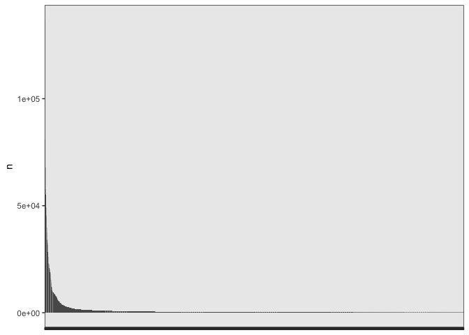

# 02_corpus_preparation

## load pckg

``` r
library(tidyverse)
library(tidytext)

library(stylo)
library(seetrees)

theme_set(theme_bw())
```

# load raw data

Load raw txt files downloaded from Gallica

``` r
fh <- list.files(path = "../corpus_raw/",
                 full.names = T,
                 pattern = "\\.txt")

corpus <- tibble(
  path = fh,
  text = sapply(path, read_file)
) %>% 
  mutate(path = str_replace_all(path, "é", "e"),
         path = str_replace_all(path, "é", "e"))

str(corpus)
```

    tibble [192 × 2] (S3: tbl_df/tbl/data.frame)
     $ path: chr [1:192] "../corpus_raw//Bancal des Issarts_1.txt" "../corpus_raw//Bancal des Issarts_2.txt" "../corpus_raw//Bancal des Issarts_3.txt" "../corpus_raw//Bancal des Issarts_4.txt" ...
     $ text: Named chr [1:192] "Rappel de votre demande:\n\nFormat de téléchargement: : Texte\n\nVues 1 à 57 sur 57\n\nNombre de pages: 57\n\nN"| __truncated__ "Rappel de votre demande:\n\nFormat de téléchargement: : Texte\n\nVues 1 à 52 sur 52\n\nNombre de pages: 52\n\nN"| __truncated__ "Rappel de votre demande:\n\nFormat de téléchargement: : Texte\n\nVues 1 à 28 sur 28\n\nNombre de pages: 28\n\nN"| __truncated__ "Rappel de votre demande:\n\nFormat de téléchargement: : Texte\n\nVues 1 à 16 sur 16\n\nNombre de pages: 16\n\nN"| __truncated__ ...
      ..- attr(*, "names")= chr [1:192] "../corpus_raw//Bancal des Issarts_1.txt" "../corpus_raw//Bancal des Issarts_2.txt" "../corpus_raw//Bancal des Issarts_3.txt" "../corpus_raw//Bancal des Issarts_4.txt" ...

Load metadata

``` r
meta <- read.delim("../metadata/metadata_selected.tsv", sep = "\t") %>% 
  select(-X)
glimpse(meta)
```

    Rows: 434
    Columns: 16
    $ id                   <int> 1, 2, 3, 4, 5, 9, 10, 14, 16, 17, 18, 19, 20, 21,…
    $ link_bnf             <chr> "http://catalogue.bnf.fr/ark:/12148/cb37236775k",…
    $ link_gallica         <chr> "https://gallica.bnf.fr/ark:/12148/bpt6k42803h", …
    $ author_short         <chr> "Bancal des Issarts", "Bancal des Issarts", "Banc…
    $ selected_for_galerie <chr> "yes", "yes", "", "", "", "", "", "yes", "", "yes…
    $ title                <chr> "Opinion sur le divorce, prononcée au Conseil des…
    $ date                 <chr> "1797", "1792", "1792", "1793-1794", "1798", "179…
    $ format               <chr> "57p___1 microfiche ; 105*148 mm", "52p___1 micro…
    $ author               <chr> "Bancal Desissarts, Jean-Henri (1750-1826). Auteu…
    $ contributors         <chr> "", "", "France. Convention nationale. Éditeur sc…
    $ editors              <chr> "Micro Graphix", "Hachette (Paris)", "Impr. natio…
    $ description          <chr> "Collection : Les archives de la Révolution franç…
    $ subject              <chr> "Divorce -- Droit -- France", "", "", "", "", "",…
    $ notes                <chr> "", "", "", "", "", "", "", "", "", "", "", "doub…
    $ title_short          <chr> "Opinion sur le divorce, prononcée au", "Du nouve…
    $ filename             <chr> "../corpus_raw/Bancal des Issarts_1.txt", "../cor…

``` r
meta_target <- read.delim("../metadata/metadata_target.tsv", sep = "\t") 
glimpse(meta_target)
```

    Rows: 9
    Columns: 16
    $ id                   <chr> "G1785_0", "G1785_1", "G1785_2", "G1785_3", "G178…
    $ link_bnf             <lgl> NA, NA, NA, NA, NA, NA, NA, NA, NA
    $ link_gallica         <lgl> NA, NA, NA, NA, NA, NA, NA, NA, NA
    $ author_short         <chr> "G1785_0", "G1785_1", "G1785_2", "G1785_3", "G178…
    $ selected_for_galerie <lgl> NA, NA, NA, NA, NA, NA, NA, NA, NA
    $ title                <chr> "Préface", "Tableau général de la littérature", "…
    $ date                 <int> 1785, 1785, 1785, 1785, 1785, 1787, 1787, 1787, 1…
    $ format               <lgl> NA, NA, NA, NA, NA, NA, NA, NA, NA
    $ author               <lgl> NA, NA, NA, NA, NA, NA, NA, NA, NA
    $ contributors         <lgl> NA, NA, NA, NA, NA, NA, NA, NA, NA
    $ editors              <lgl> NA, NA, NA, NA, NA, NA, NA, NA, NA
    $ description          <lgl> NA, NA, NA, NA, NA, NA, NA, NA, NA
    $ subject              <lgl> NA, NA, NA, NA, NA, NA, NA, NA, NA
    $ notes                <lgl> NA, NA, NA, NA, NA, NA, NA, NA, NA
    $ title_short          <lgl> NA, NA, NA, NA, NA, NA, NA, NA, NA
    $ filename             <chr> "../corpus_raw/G1785_0_Préface.txt", "../corpus_r…

``` r
# join target & ref metadata
meta <- rbind(meta, meta_target)

# join corpus with metadata
corpus_m <- meta %>% 
  mutate(path = str_replace(filename, "corpus_raw/", "corpus_raw//")) %>% 
  #filename mistakes
  mutate(path = str_replace_all(path, "é", "e"),
         path = str_replace_all(path, "é", "e")) %>% 
  left_join(corpus, by = "path")

str(corpus_m)
```

    'data.frame':   443 obs. of  18 variables:
     $ id                  : chr  "1" "2" "3" "4" ...
     $ link_bnf            : chr  "http://catalogue.bnf.fr/ark:/12148/cb37236775k" "http://catalogue.bnf.fr/ark:/12148/cb346933758" "http://catalogue.bnf.fr/ark:/12148/cb30051725x" "http://catalogue.bnf.fr/ark:/12148/cb300517148" ...
     $ link_gallica        : chr  "https://gallica.bnf.fr/ark:/12148/bpt6k42803h" "https://gallica.bnf.fr/ark:/12148/bpt6k85298x" "https://gallica.bnf.fr/ark:/12148/bpt6k42324856" "https://gallica.bnf.fr/ark:/12148/bpt6k853041" ...
     $ author_short        : chr  "Bancal des Issarts" "Bancal des Issarts" "Bancal des Issarts" "Bancal des Issarts" ...
     $ selected_for_galerie: chr  "yes" "yes" "" "" ...
     $ title               : chr  "Opinion sur le divorce, prononcée au Conseil des Cinq-cents, le 12 pluviôse an 5 ([Reprod.]) par Jean-Henry Bancal,..." "Du nouvel ordre social ([Reprod.]) par Henry Bancal,..." "Convention nationale. Discours et projet de décret sur l'éducation nationale, prononcés à la Convention nationa"| __truncated__ "Henri Bancal, député à la Convention, à Anacharsis Clootz, son collègue" ...
     $ date                : chr  "1797" "1792" "1792" "1793-1794" ...
     $ format              : chr  "57p___1 microfiche ; 105*148 mm" "52p___1 microfiche acétate de 98 images, diazoïque ; 105 * 148 mm" "In-8° , 28 p." "16 p. ; in-8" ...
     $ author              : chr  "Bancal Desissarts, Jean-Henri (1750-1826). Auteur du texte" "Bancal Desissarts, Jean-Henri (1750-1826). Auteur du texte" "Bancal Desissarts, Jean-Henri (1750-1826). Auteur du texte" "Bancal Desissarts, Jean-Henri (1750-1826). Auteur du texte" ...
     $ contributors        : chr  "" "" "France. Convention nationale. Éditeur scientifique" "" ...
     $ editors             : chr  "Micro Graphix" "Hachette (Paris)" "Impr. nationale (Paris)" "Impr. du Cercle social (Paris)" ...
     $ description         : chr  "Collection : Les archives de la Révolution française ; 9.4.338" "" "" "" ...
     $ subject             : chr  "Divorce -- Droit -- France" "" "" "" ...
     $ notes               : chr  "" "" "" "" ...
     $ title_short         : chr  "Opinion sur le divorce, prononcée au" "Du nouvel ordre social ([Reprod.]) par" "Convention nationale. Discours et projet de" "Henri Bancal, député à la Convention," ...
     $ filename            : chr  "../corpus_raw/Bancal des Issarts_1.txt" "../corpus_raw/Bancal des Issarts_2.txt" "../corpus_raw/Bancal des Issarts_3.txt" "../corpus_raw/Bancal des Issarts_4.txt" ...
     $ path                : chr  "../corpus_raw//Bancal des Issarts_1.txt" "../corpus_raw//Bancal des Issarts_2.txt" "../corpus_raw//Bancal des Issarts_3.txt" "../corpus_raw//Bancal des Issarts_4.txt" ...
     $ text                : Named chr  "Rappel de votre demande:\n\nFormat de téléchargement: : Texte\n\nVues 1 à 57 sur 57\n\nNombre de pages: 57\n\nN"| __truncated__ "Rappel de votre demande:\n\nFormat de téléchargement: : Texte\n\nVues 1 à 52 sur 52\n\nNombre de pages: 52\n\nN"| __truncated__ "Rappel de votre demande:\n\nFormat de téléchargement: : Texte\n\nVues 1 à 28 sur 28\n\nNombre de pages: 28\n\nN"| __truncated__ "Rappel de votre demande:\n\nFormat de téléchargement: : Texte\n\nVues 1 à 16 sur 16\n\nNombre de pages: 16\n\nN"| __truncated__ ...
      ..- attr(*, "names")= chr [1:443] "../corpus_raw//Bancal des Issarts_1.txt" "../corpus_raw//Bancal des Issarts_2.txt" "../corpus_raw//Bancal des Issarts_3.txt" "../corpus_raw//Bancal des Issarts_4.txt" ...

Number of documents for each author

``` r
corpus_m %>% 
  filter(!is.na(text)) %>% 
  count(author_short, sort = T) %>% head()
```

      author_short  n
    1      Baudeau 25
    2     Bergasse 18
    3     Clavière 17
    4      Mercier  8
    5    Condorcet  7
    6       Barère  6

### headers cleaning

``` r
t <- corpus_m %>% 
  filter(!is.na(text)) %>% 
  
  # headers cleaning
  # remove all new lines as it's not easy to manipulate with sep strings
  mutate(text_cln = str_replace_all(text, "\\n\\n|\\n", " "),
         text_cln = str_replace_all(text_cln, "\\r\\n", " "),
         # remove everything before % and first separator ----
         text_cln = str_remove_all(text_cln, "^.*?%\\.\\s?----------"),
         
         # replace ' with space for cleaner tokenization (qu'il => qu il )
         text_cln = str_replace_all(text_cln, "'", " "), 
         text_cln = str_replace_all(text_cln , "’", " ")) %>% 
  
  # OCR accuracy extraction
  mutate(ocr_acc = str_extract(text, "Le taux de reconnaissance estimé pour ce document est de \\d+%"),
         ocr_acc = str_extract(ocr_acc, "est de \\d+%"),
         ocr_acc = str_remove_all(ocr_acc, "est de |%")) %>% 
  
  # add sth for the added manually texts (Epremesnil & Talleyrand), otherwise NA will be removed with filter
  mutate(ocr_acc = ifelse(is.na(ocr_acc), 1, ocr_acc))

# leave only existing texts (OCR is 0 for no OCR)
corpus_texts <- t %>% 
  filter(ocr_acc != "0")
```

### corpus overview

Number of text for each author

``` r
corpus_texts %>% 
  count(author_short, sort = T)
```

               author_short  n
    1              Bergasse 15
    2               Baudeau 11
    3              Clavière 10
    4               Mercier  7
    5            Desmoulins  6
    6            Eprémesnil  6
    7                Barère  5
    8                Manuel  5
    9                Pétion  4
    10  Silléry (Genlis Ch)  4
    11           Talleyrand  4
    12   Bancal des Issarts  3
    13           Bonneville  3
    14               Danton  3
    15              Dusaulx  3
    16              Fauchet  3
    17               Gouges  3
    18               Laclos  3
    19           Lacretelle  3
    20             Mirabeau  3
    21           Mme Genlis  3
    22             Pastoret  3
    23              Brissot  2
    24                Carra  2
    25            Condorcet  2
    26           D'Alembert  2
    27     Delisle de Sales  2
    28               Dupaty  2
    29                Garat  2
    30  Sabatier de Castres  2
    31               Sieyès  2
    32              Ducrest  1
    33              G1785_0  1
    34              G1785_1  1
    35              G1785_2  1
    36              G1785_3  1
    37              G1785_4  1
    38              G1787_5  1
    39              G1787_6  1
    40              G1787_7  1
    41              G1787_8  1
    42          La Platière  1
    43             La Salle  1
    44                Marat  1
    45 Rabaut Saint-Étienne  1
    46               Target  1

## tokenization

Count number of tokens

``` r
corpus_tokenized <- corpus_texts %>% 
  unnest_tokens(input = text_cln, output = word, token = "words")

corpus_tokenized %>% 
  count(author_short, sort = T) %>% tail(20)
```

               author_short     n
    27                Marat 30066
    28 Rabaut Saint-Étienne 28485
    29           Mme Genlis 28342
    30   Bancal des Issarts 25183
    31              Fauchet 23275
    32               Gouges 17347
    33             La Salle 16508
    34              G1785_1 14951
    35  Silléry (Genlis Ch) 13129
    36            Condorcet 12989
    37              G1787_7 12306
    38              G1787_5 11926
    39              G1787_6 11741
    40              G1785_3  9208
    41              G1787_8  8836
    42              G1785_0  8395
    43              G1785_2  7103
    44           Eprémesnil  6205
    45              G1785_4  4054
    46          La Platière   954

Target texts sizes

``` r
corpus_tokenized %>% 
  count(author_short, sort = F) %>% 
  filter(str_detect(author_short, "G17"))
```

      author_short     n
    1      G1785_0  8395
    2      G1785_1 14951
    3      G1785_2  7103
    4      G1785_3  9208
    5      G1785_4  4054
    6      G1787_5 11926
    7      G1787_6 11741
    8      G1787_7 12306
    9      G1787_8  8836

# features cln

MFW in the corpus

``` r
mfw <- corpus_tokenized %>% 
  group_by(word) %>% 
  count(sort = T) %>% 
  head(2000) 

mfw # just a look at the table and the curve
```

    # A tibble: 2,000 × 2
    # Groups:   word [2,000]
       word       n
       <chr>  <int>
     1 de    136904
     2 la     80999
     3 les    67821
     4 le     57629
     5 l      55286
     6 à      49281
     7 des    45837
     8 que    45093
     9 il     39968
    10 d      37451
    # ℹ 1,990 more rows

``` r
mfw %>% 
  ggplot(aes(x = reorder(word, -n), y = n)) + 
  geom_col() + 
  theme(axis.text.x = element_blank(),
        axis.title.x = element_blank())
```



MFW 1000

``` r
x <- mfw %>% pull(word)
#x[1000:2000]
x[1:100]
```

      [1] "de"       "la"       "les"      "le"       "l"        "à"       
      [7] "des"      "que"      "il"       "d"        "et"       "qui"     
     [13] "en"       "qu"       "un"       "dans"     "a"        "ne"      
     [19] "du"       "est"      "une"      "pour"     "n"        "on"      
     [25] "plus"     "ce"       "par"      "s"        "pas"      "au"      
     [31] "je"       "c"        "nous"     "vous"     "se"       "m"       
     [37] "y"        "cette"    "ou"       "ces"      "ils"      "sur"     
     [43] "mais"     "elle"     "lui"      "leur"     "j"        "tout"    
     [49] "avec"     "même"     "son"      "aux"      "tous"     "ses"     
     [55] "t"        "si"       "être"     "comme"    "i"        "ont"     
     [61] "e"        "bien"     "sa"       "dont"     "fait"     "leurs"   
     [67] "1"        "sont"     "faire"    "peut"     "où"       "sans"    
     [73] "point"    "me"       "eft"      "encore"   "toutes"   "étoit"   
     [79] "avoir"    "deux"     "été"      "nos"      "font"     "moins"   
     [85] "hommes"   "homme"    "avoit"    "autres"   "ai"       "ceux"    
     [91] "cet"      "donc"     "autre"    "toujours" "faut"     "peuple"  
     [97] "r"        "p"        "fur"      "elles"   

Cleaning based on the 2000 MFW

``` r
# vector of errors from 1000 MFW
errors <- unlist(strsplit(
  c("i e r sc p ii v o u z h g re in b k iii iv x i liv ï st é q tion eh pro ut vi ks fl ré sor er ah ie ft w mi î nt xiv di 8c 6c ion ôcq mr it do ï iv tt ea î pa us w iii net tems hui fol x li ôc mm ark ia gré er cc vol co da entr ki tome ja xvi pag ad no ns po ue of col ex ri im at em ix ô ju ti tre the if vo to ot ar ur oc mo ë ies al mt oit res ç http is ke catalogue.bnf.fr id ij vii supplicei e r sc p ii v o u z h g re in b k iii iv x i liv ï st é q tion eh pro ut vi ks fl ré sor er ah ie ft w mi î nt xiv di 8c 6c п ion ôcq mr it do ï é iv tt ea î pa us w iii net font fous"),
  " "  )
  )

corpus_tokenized <- corpus_tokenized %>% 
  # remove digits
  filter(!str_detect(word, "\\d+")) %>% 
  
  # remove noisy characters
  filter(!word %in% errors) %>% 
  
  # long s replacements
  mutate(word = str_replace(word, "^f$", "s"),
         word = str_replace(word, "^fe$", "se"),
         word = str_replace(word, "^fa$", "sa"),
         word = str_replace(word, "^eft$", "est"),
         word = str_replace(word, "^efl$", "est"),
         word = str_replace(word, "^dé$", "de"),
         word = str_replace(word, "^fon$", "son"),
         word = str_replace(word, "^fes$", "ses"),
         word = str_replace(word, "^fi$", "si"),
         word = str_replace(word, "^ame$", "âme"),
         word = str_replace(word, "^lés$", "les"),
         word = str_replace(word, "^lé$", "le"),
         word = str_replace(word, "^ainfi$", "ainsi"),
         word = str_replace(word, "^efprit$", "esprit"),
         word = str_replace(word, "^fans$", "sans"),
         word = str_replace(word, "^efi$", "est"),
         word = str_replace(word, "^eff$", "est"),
         word = str_replace(word, "^fu$", "su"),
         word = str_replace(word, "^lés$", "les"),
         word = str_replace(word, "^foin$", "soin"),
         word = str_replace(word, "^chofes$", "choses"),
         word = str_replace(word, "^chofe$", "chose"),
         word = str_replace(word, "^prefque$", "presque"),
         word = str_replace(word, "^ufage$", "usage"),
         word = str_replace(word, "^caufe$", "cause"),
         word = str_replace(word, "^fera$", "sera"),
         word = str_replace(word, "^fur$", "sur"),
         word = str_replace(word, "^fang$", "sang"),
         word = str_replace(word, "^hiftoire$", "histoire"),
         word = str_replace(word, "^fage$", "sage"),
         word = str_replace(word, "^foient$", "soient"),
         word = str_replace(word, "^feule$", "seule"))

# proper names to remove (?)
# rousseau izerben kornmann mesmer mefmer orléans montagne beaumarchais descartes
```

Fast check MFW

``` r
corpus_tokenized %>% 
  group_by(word) %>% 
  count(word, sort = T) %>% head(10)
```

    # A tibble: 10 × 2
    # Groups:   word [10]
       word       n
       <chr>  <int>
     1 de    137732
     2 la     80999
     3 les    68015
     4 le     57883
     5 l      55286
     6 à      49281
     7 des    45837
     8 que    45093
     9 il     39968
    10 d      37451

``` r
corpus_tokenized %>% 
  group_by(word) %>% 
  count(word, sort = T) %>% head(100) %>% pull(word) 
```

      [1] "de"       "la"       "les"      "le"       "l"        "à"       
      [7] "des"      "que"      "il"       "d"        "et"       "qui"     
     [13] "en"       "qu"       "un"       "est"      "dans"     "a"       
     [19] "ne"       "du"       "une"      "pour"     "n"        "on"      
     [25] "plus"     "ce"       "par"      "s"        "pas"      "au"      
     [31] "se"       "je"       "sur"      "c"        "nous"     "vous"    
     [37] "son"      "m"        "y"        "cette"    "ses"      "ou"      
     [43] "ces"      "ils"      "si"       "mais"     "elle"     "lui"     
     [49] "leur"     "j"        "sa"       "tout"     "avec"     "même"    
     [55] "aux"      "tous"     "t"        "être"     "comme"    "ont"     
     [61] "sans"     "bien"     "dont"     "fait"     "leurs"    "sont"    
     [67] "faire"    "peut"     "où"       "point"    "me"       "encore"  
     [73] "toutes"   "étoit"    "avoir"    "deux"     "été"      "nos"     
     [79] "moins"    "hommes"   "homme"    "avoit"    "autres"   "ai"      
     [85] "ceux"     "cet"      "donc"     "autre"    "toujours" "faut"    
     [91] "peuple"   "elles"    "liberté"  "contre"   "doit"     "toute"   
     [97] "notre"    "grand"    "ni"       "dit"     

## save

``` r
glimpse(corpus_tokenized)
```

    Rows: 2,901,987
    Columns: 20
    $ id                   <chr> "1", "1", "1", "1", "1", "1", "1", "1", "1", "1",…
    $ link_bnf             <chr> "http://catalogue.bnf.fr/ark:/12148/cb37236775k",…
    $ link_gallica         <chr> "https://gallica.bnf.fr/ark:/12148/bpt6k42803h", …
    $ author_short         <chr> "Bancal des Issarts", "Bancal des Issarts", "Banc…
    $ selected_for_galerie <chr> "yes", "yes", "yes", "yes", "yes", "yes", "yes", …
    $ title                <chr> "Opinion sur le divorce, prononcée au Conseil des…
    $ date                 <chr> "1797", "1797", "1797", "1797", "1797", "1797", "…
    $ format               <chr> "57p___1 microfiche ; 105*148 mm", "57p___1 micro…
    $ author               <chr> "Bancal Desissarts, Jean-Henri (1750-1826). Auteu…
    $ contributors         <chr> "", "", "", "", "", "", "", "", "", "", "", "", "…
    $ editors              <chr> "Micro Graphix", "Micro Graphix", "Micro Graphix"…
    $ description          <chr> "Collection : Les archives de la Révolution franç…
    $ subject              <chr> "Divorce -- Droit -- France", "Divorce -- Droit -…
    $ notes                <chr> "", "", "", "", "", "", "", "", "", "", "", "", "…
    $ title_short          <chr> "Opinion sur le divorce, prononcée au", "Opinion …
    $ filename             <chr> "../corpus_raw/Bancal des Issarts_1.txt", "../cor…
    $ path                 <chr> "../corpus_raw//Bancal des Issarts_1.txt", "../co…
    $ text                 <chr> "Rappel de votre demande:\n\nFormat de télécharge…
    $ ocr_acc              <chr> "94", "94", "94", "94", "94", "94", "94", "94", "…
    $ word                 <chr> "microcopy", "resotution", "test", "chart", "nbs"…

``` r
corpus_tokenized %>% 
  count(author_short, sort = T)
```

               author_short      n
    1               Baudeau 325247
    2               Mercier 233148
    3              Bergasse 220122
    4                Danton 193382
    5               Dusaulx 186027
    6   Sabatier de Castres 140730
    7                Barère 113645
    8              Clavière 103202
    9            D'Alembert  92850
    10           Bonneville  88185
    11           Lacretelle  87104
    12                Carra  84919
    13               Manuel  82187
    14     Delisle de Sales  68854
    15               Dupaty  68485
    16              Ducrest  67193
    17             Mirabeau  55538
    18               Pétion  50763
    19             Pastoret  50463
    20                Garat  48693
    21           Desmoulins  47160
    22               Laclos  44625
    23               Target  44483
    24              Brissot  43161
    25               Sieyès  42714
    26           Talleyrand  36734
    27                Marat  29652
    28           Mme Genlis  27570
    29 Rabaut Saint-Étienne  26624
    30   Bancal des Issarts  24455
    31              Fauchet  22813
    32               Gouges  17063
    33             La Salle  16210
    34              G1785_1  14447
    35  Silléry (Genlis Ch)  12750
    36            Condorcet  12729
    37              G1787_7  11891
    38              G1787_5  11616
    39              G1787_6  11392
    40              G1785_3   8935
    41              G1787_8   8558
    42              G1785_0   8112
    43              G1785_2   6830
    44           Eprémesnil   5874
    45              G1785_4   3950
    46          La Platière    902

``` r
corpus_tokenized %>% 
  count(author_short) %>% 
  filter(str_detect(author_short, "G17"))
```

      author_short     n
    1      G1785_0  8112
    2      G1785_1 14447
    3      G1785_2  6830
    4      G1785_3  8935
    5      G1785_4  3950
    6      G1787_5 11616
    7      G1787_6 11392
    8      G1787_7 11891
    9      G1787_8  8558

``` r
corpus_joined <- corpus_tokenized %>% 
  group_by(path) %>% 
  mutate(text = paste(word, collapse = " ")) %>% 
  select(-word) %>% 
  distinct() %>% 
  
  # create new path
  mutate(path = str_replace(path, "corpus_raw", "corpus_cln"))
```

``` r
head(corpus_joined)
```

    # A tibble: 6 × 19
    # Groups:   path [6]
      id    link_bnf      link_gallica author_short selected_for_galerie title date 
      <chr> <chr>         <chr>        <chr>        <chr>                <chr> <chr>
    1 1     http://catal… https://gal… Bancal des … "yes"                Opin… 1797 
    2 3     http://catal… https://gal… Bancal des … ""                   Conv… 1792 
    3 5     http://catal… https://gal… Bancal des … ""                   Des … 1798 
    4 9     http://catal… https://gal… Barère       ""                   Rapp… 1794…
    5 10    http://catal… https://gal… Barère       ""                   Obse… 1789 
    6 14    http://catal… https://gal… Barère       "yes"                Mont… 1796…
    # ℹ 12 more variables: format <chr>, author <chr>, contributors <chr>,
    #   editors <chr>, description <chr>, subject <chr>, notes <chr>,
    #   title_short <chr>, filename <chr>, path <chr>, text <chr>, ocr_acc <chr>

Write cleaned files to a folder

``` r
fh <- corpus_joined$path
texts <- corpus_joined$text

for (i in 1:length(fh)) {
  write_file(texts[i], file = fh[i])
}
```
