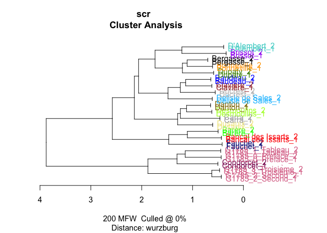
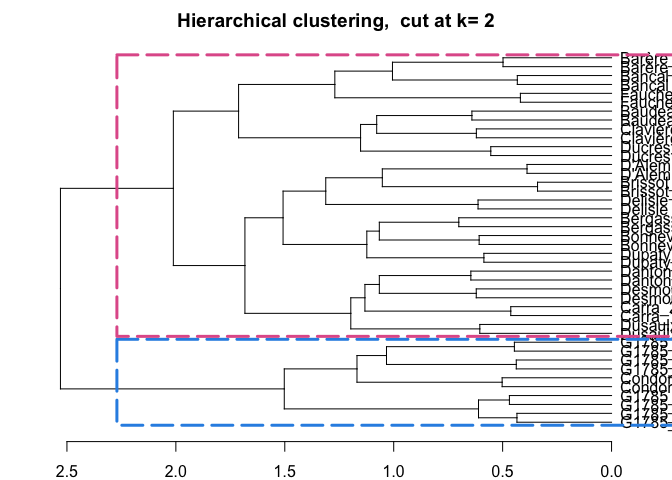
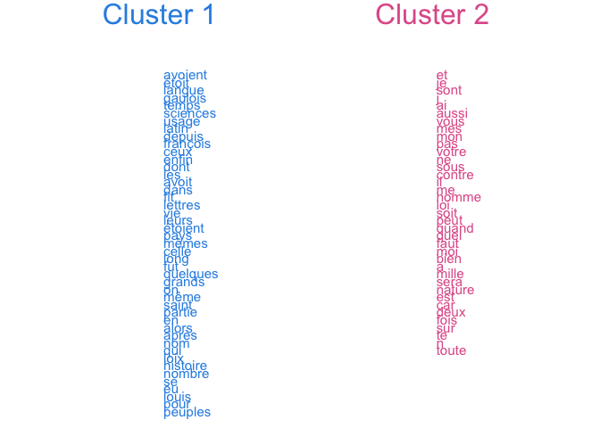
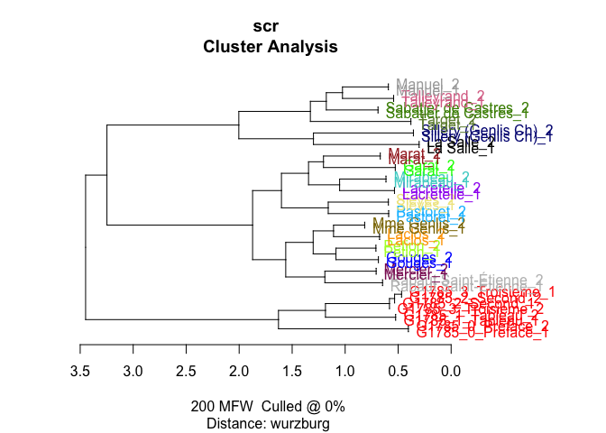
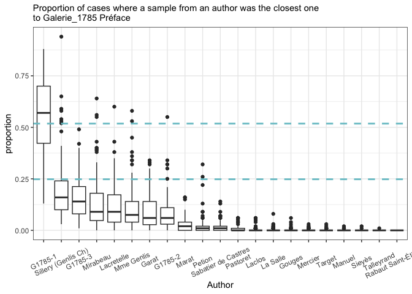

# G1785

# Description

This notebook uses the pipeline for authorship attribution using basic
stylo() clustering, extracts features from it and apply authorship
verification methods (GI). In addition the distances distribution
between authors is checked.

## Corpus

The corpus is prepared using:

-   an extended bibliography for ~40 authors from the short list;

-   script to get links to gallica, given the catalogue links;

-   script to download OCR texts from gallica, given the gallica links;

-   script to download PDF files, given the gallica links (not fully
    used yet);

-   script for texts cleaning (long s replacements, etc.)

## Methods

-   Independent text sampling

-   Basic analysis with stylo() (mostly for features selection);

-   Comparison of distances distribution

-   General imposters

Authors are splited in two sets

### load pckg

``` r
library(tidyverse)
library(tidytext)

library(stylo)
library(seetrees)

theme_set(theme_bw())
```

### functions

Helper functions from Artjoms:

Sampling

``` r
sample_independent_opt <- function(tokenized_df,
                                   n_samples,
                                   sample_size,
                                   text_var = "word",
                                   folder = "../corpus_sampled/",
                                   overwrite=T) {
  
  dir.create(folder)
  
  if(overwrite) {
    do.call(file.remove, list(list.files(folder, full.names = TRUE)))
    }
  
  shuff <- tokenized_df %>%
    group_by(author) %>% 
  sample_n(n_samples * sample_size) %>% # sample tokens 
  # to each sampled token assign randomly a sample number
  mutate(sample_x = sample( # sample = reshuffle the numbers of samples repeated below
    rep( # repeat
    1:n_samples, # the numbers of samples (1, 2, 3...)
    each = sample_size # each is sample_size times repeated
    ))) %>% 
  # create a column author_sampleX
  unite(sample_id, c(author, sample_x), remove = F) %>% 
  
  # group and paste together by sample_id (some kind of special paste with !!sym() )
  group_by(sample_id) %>% 
  summarise(text = paste(!!sym(text_var), collapse = " ")) 
  
  # write samples
  for(i in 1:nrow(shuff)) {
      write_file(file=paste0(folder, shuff$sample_id[i],".txt"), shuff$text[i])
  }
}   
```

Stylo customization

``` r
diy_stylo <- function(folder = "../corpus_sampled/",
                      mfw = 200,
                      drop_words = T,
                      feature = "word",
                      n_gram = 1) {
  
  # read the sampled texts from the folder corpus_sampled/
  # the feature is either word or charaters prob
  # the tokenizer returns lists of tokens for each text
  tokenized.texts = load.corpus.and.parse(
    files = list.files(folder, full.names = T),
    features = feature,
    ngram.size = n_gram
    )

  # computing a list of most frequent words (trimmed to top 2000 items):
  features = make.frequency.list(tokenized.texts, head = 2000)
  # producing a table of relative frequencies:
  data = make.table.of.frequencies(tokenized.texts, features, relative = TRUE)#[,1:mfw]
  
  # --- cleaning ---
  # remove stop words
  s_words <- str_detect(colnames(data),paste(strong_words,collapse="|"))

  if(drop_words) {
  data <- data[,!s_words]
  }
  
  # crop mfw 
  data <- data[, 1:mfw]
  
  # clean document names
  rownames(data) <- str_remove_all(rownames(data), "^.*?//") # clean rownames from full paths
  
  # output
  return(data)
}
```

### load data

``` r
fh <- list.files(path = "../corpus_cln/", 
                 full.names = T)

# corpus compilation
corpus <- tibble(
  path = fh,
  text = sapply(path, read_file)
)

# preparation for tokenisation
corpus_t <- corpus %>% 
  # remove G1787
  filter(!str_detect(path, "G1787")) %>% 
  
  # extract authors
  mutate(author = ifelse(str_detect(path, "G1785"), # keep G1785 names
                         str_extract(path, "G1785_\\d+_\\w+"),
                         # extract all others
                         str_extract(path, "corpus_cln//.*?_")), 
         # cleaning
         author = str_remove_all(author, "corpus_cln//|_$")) %>% 
  
  # remove paths for individual files
  select(-path)

str(corpus_t)
```

    tibble [139 × 2] (S3: tbl_df/tbl/data.frame)
     $ text  : Named chr [1:139] "microcopy resotution test chart nbs ansi and iso test chart french revolution research collejoton lesarchivesde"| __truncated__ "convention nationale j c s et projet de décret sur l éducation nationale prononcés a la convention nationale le"| __truncated__ "des prochaines tee t s de l an par jean henri bancal représentant du peuple à la convention nationale au consei"| __truncated__ "observations j rés entées üiu a l assemblee nationale par m parère de fieuzac député du bigorue sur la nécejfit"| __truncated__ ...
      ..- attr(*, "names")= chr [1:139] "../corpus_cln//Bancal des Issarts_1.txt" "../corpus_cln//Bancal des Issarts_3.txt" "../corpus_cln//Bancal des Issarts_5.txt" "../corpus_cln//Barère_10.txt" ...
     $ author: chr [1:139] "Bancal des Issarts" "Bancal des Issarts" "Bancal des Issarts" "Barère" ...

``` r
unique(corpus_t$author)
```

     [1] "Bancal des Issarts"   "Barère"               "Baudeau"             
     [4] "Bergasse"             "Bonneville"           "Brissot"             
     [7] "Carra"                "Clavière"             "Condorcet"           
    [10] "D'Alembert"           "Danton"               "Delisle de Sales"    
    [13] "Desmoulins"           "Ducrest"              "Dupaty"              
    [16] "Dusaulx"              "Epremesnil"           "Fauchet"             
    [19] "G1785_0_Preface"      "G1785_1_Tableau"      "G1785_2_Second"      
    [22] "G1785_3_Troisième"    "G1785_4_Discours"     "Garat"               
    [25] "Gouges"               "La Platière"          "La Salle"            
    [28] "Laclos"               "Lacretelle"           "Manuel"              
    [31] "Marat"                "Mercier"              "Mirabeau"            
    [34] "Mme Genlis"           "Pastoret"             "Petion"              
    [37] "Rabaut Saint-Étienne" "Sabatier de Castres"  "Sieyès"              
    [40] "Sillery (Genlis Ch)"  "Talleyrand"           "Target"              

Tokenization

``` r
corpus_tokenized <- corpus_t %>% 
  unnest_tokens(input = text, output = word, token = "words")
```

    Warning: Outer names are only allowed for unnamed scalar atomic inputs

``` r
sample_n(corpus_tokenized, 6)
```

    # A tibble: 6 × 2
      author   word      
      <chr>    <chr>     
    1 Dusaulx  étranger  
    2 Brissot  vœux      
    3 Clavière de        
    4 Danton   dépendance
    5 Bergasse comme     
    6 Clavière de        

## n tokens

``` r
corpus_tokenized %>% 
  filter(!str_detect(author, "^G1785")) %>% 
  count(author, sort = T) %>% tail(10)
```

    # A tibble: 10 × 2
       author                   n
       <chr>                <int>
     1 Mme Genlis           27570
     2 Rabaut Saint-Étienne 26624
     3 Bancal des Issarts   24455
     4 Fauchet              22813
     5 Gouges               17063
     6 La Salle             16210
     7 Sillery (Genlis Ch)  12750
     8 Condorcet            12729
     9 Epremesnil            5874
    10 La Platière            902

``` r
corpus_tokenized %>% 
  filter(str_detect(author, "^G1785")) %>% 
  count(author, sort = F)
```

    # A tibble: 5 × 2
      author                n
      <chr>             <int>
    1 G1785_0_Preface    8112
    2 G1785_1_Tableau   14447
    3 G1785_2_Second     6830
    4 G1785_3_Troisième  8935
    5 G1785_4_Discours   3950

min size: 3972 (Discours preliminaire), La Platière - 904, Epremesnil -
5888

``` r
corpus_tokenized <- corpus_tokenized %>% 
  # too small sample
  filter(author != "La Platière")

short_samples <- corpus_tokenized %>% 
  count(author) %>% 
  filter(n < 6000) %>% 
  pull(author)

# store shortest in a variable for easier removal later
short_samples
```

    [1] "Epremesnil"       "G1785_4_Discours"

## authors to sets

``` r
# all authors in the set
authors <- unique(corpus_t$author)

# all authors before the letter G 
before_G <- grep("G1785", authors)[1]
after_G <- grep("G1785", authors)[5]

authors_1 <- authors[1:before_G-1]
authors_2 <- authors[after_G+1:19]

length(authors)
```

    [1] 42

``` r
authors_1
```

     [1] "Bancal des Issarts" "Barère"             "Baudeau"           
     [4] "Bergasse"           "Bonneville"         "Brissot"           
     [7] "Carra"              "Clavière"           "Condorcet"         
    [10] "D'Alembert"         "Danton"             "Delisle de Sales"  
    [13] "Desmoulins"         "Ducrest"            "Dupaty"            
    [16] "Dusaulx"            "Epremesnil"         "Fauchet"           

``` r
authors_2
```

     [1] "Garat"                "Gouges"               "La Platière"         
     [4] "La Salle"             "Laclos"               "Lacretelle"          
     [7] "Manuel"               "Marat"                "Mercier"             
    [10] "Mirabeau"             "Mme Genlis"           "Pastoret"            
    [13] "Petion"               "Rabaut Saint-Étienne" "Sabatier de Castres" 
    [16] "Sieyès"               "Sillery (Genlis Ch)"  "Talleyrand"          
    [19] "Target"              

``` r
target <- authors[grep("G1785", authors)]
target
```

    [1] "G1785_0_Preface"   "G1785_1_Tableau"   "G1785_2_Second"   
    [4] "G1785_3_Troisième" "G1785_4_Discours" 

# SET 1

## Sampling

``` r
sample_independent_opt(
  tokenized_df = corpus_tokenized %>% 
    # select author set here!
    filter(author %in% target | author %in% authors_1) %>% 
    filter(!author %in% short_samples), 
  n_samples = 2, 
  sample_size = 3000)
```

    Warning in dir.create(folder): '../corpus_sampled' already exists

## naive stylo()

``` r
set.seed(567)
```

``` r
test1 <- stylo(
  gui = F,
  corpus.dir = "../corpus_sampled/",
  corpus.lang = "Other",
  
  mfw.min = 200,
  mfw.max = 200,
  analyzed.features = "w",
  ngram.size = 1,
  distance.measure = "wurzburg"
)
```



Look into the MFW used

``` r
test1$features.actually.used
```


    ------------------------------------------------
    features (e.g. frequent words) actually analyzed 
    ------------------------------------------------

      [1]  de            la            les           le            l             
      [6]  des           à            que           d             qui           
     [11]  il            en            et            dans          qu            
     [16]  un            est           du            a             pour          
     [21]  une           ne            on            n             par           
     [26]  s             ce            plus          c             au            
     [31]  pas           nous          se            sur           y             
     [36]  ils           ces           je            son           si            
     [41]  tous          t             vous          m             leur          
     [46]  cette         ou            sa            même         ses           
     [51]  aux           mais          avec          ont           comme         
     [56]  j             tout          elle          être         lui           
     [61]  dont          leurs         fait          où           bien          
     [66]  langue        sans          étoit        nos           toutes        
     [71]  faire         encore        été         point         peut          
     [76]  sont          avoit         autres        peuple        moins         
     [81]  hommes        temps         liberté      ceux          notre         
     [86]  deux          autre         faut          toujours      avoir         
     [91]  me            ai            homme         fut           contre        
     [96]  donc          cet           ni            après        ainsi         
    [101]  france        grand         dit           doit          peu           
    [106]  nature        tant          toute         celui         celle         
    [111]  latin         dire          elles         là           roi           
    [116]  esprit        eux           non           quelques      gouvernement  
    [121]  grande        quand         depuis        premier       enfin         
    [126]  jamais        nombre        trop          alors         entre         
    [131]  grands        sera          peuples       trois         nation        
    [136]  partie        lettres       ordre         république   paris         
    [141]  corps         parce         rien          eu            mon           
    [146]  très         fois          françois     public        loi           
    [151]  pouvoir       ans           arts          étoient      mêmes        
    [156]  soit          vie           voir          aussi         avoient       
    [161]  dieu          monde         saint         car           ici           
    [166]  louis         citoyens      état         nom           avant         
    [171]  force         livres        cependant     gaulois       jour          
    [176]  loix          vos           ma            seule         sous          
    [181]  votre         donner        aucun         droit         langage       
    [186]  mille         société     histoire      lois          sciences      
    [191]  vers          voit          autant        terre         usage         
    [196]  vérité      es            or            révolution   millions      

    (total number of elements:  200)

``` r
view_tree(test1, k = 2, label_size = 4)
```





## bct

``` r
# take other samples
sample_independent_opt(
  tokenized_df = corpus_tokenized %>% # select author set here!
    filter(author %in% target | author %in% authors_1) %>% 
    filter(!author %in% short_samples), 
  n_samples = 2, 
  sample_size = 3000)

# bootstrap consensus
bct <- stylo(
  gui = F,
  corpus.dir = "../corpus_sampled/",
  corpus.lang = "Other",
  
  analyzed.features = "w",
  ngram.size = 1,
  mfw.min = 50,
  mfw.max = 250,
  mfw.incr = 1,
  distance.measure = "wurzburg",
  
  analysis.type = "BCT",
  consensus.strength = 0.5
  
)
```


## strong words removal

Based on the see_trees

``` r
strong_words <- c("^peuples", "^louis", "^liberté", "^citoyens", 
                  "^nation", "^aujourd", "^je", "^me", "^ma", "^j", "^mon")
```

## distances

### functions

Analysis from diy_stylo

``` r
# stylo_res - distance.table from the stylo ouput stylo.data (list)

process_distances <- function(stylo_res) {
  dt <- stylo_res %>% as.matrix() # this is needed as native stylo matrix won't word with ggplot (?)
  d_long <- dt %>% 
  # transform the matrix to tibble object
  as_tibble() %>% 
  # create a column 'source' with the exact same names as the column names (back to matrix view)
  mutate(source = colnames(dt)) %>% 
  # transform to the long table with source - target pair and their distance
  pivot_longer(#1:nrow(dt),
              !source, # same as 1:nrow(dt) which basically mean 1:all_cols before the 'source' 
               names_to = "target",
               values_to = "distance") %>% 
  # clean names
  mutate(source = str_remove(source, "_[0-9]*$"),
         target = str_remove(target, "_[0-9]*$")) %>% 
  # remove the same author pairs
  filter(distance != 0)
  
  return(d_long)
}
```

Plot

``` r
# df - table reaulted from the transformation of a distance matrix to the long table
# required columns: source, target, distance + MEAN (calculated after multiple samples taken)

lannister <- c("#5C0000", "#890000", "#C50000", "#FB7E00", "#FFA700")

plot_distances <- function(df) {
  df %>% 
  ggplot(aes(distance, fill = mean)) + # density colour filled inside according to the xmean value
    geom_density(alpha = 0.6) + # density plot
    geom_vline(aes(xintercept = mean)) + # add a vertical line to explicitly show the mean
    facet_grid(source ~ target,scales = "free_y") + # matrix of density plots
    theme_bw() + 
    # colours
    scale_fill_gradient2(high=lannister[1],
                         mid=lannister[3],
                         low=lannister[5],
                         midpoint=1.05)
  
}
```

### experiment

``` r
iters = 50
min_features = 50
max_features = 200

d_res_w = vector(mode = "list", length = iters)

corpus_short <- corpus_tokenized %>% 
    # select author set here!
    filter(author %in% target | author %in% authors_1) %>% 
    filter(!author %in% short_samples)

for (i in 1:iters) { 
  mfw <- sample( # sample sampling of X most freq words as features from a sequence of features
    seq(min_features, max_features, by = 10),
    1
  )
  
  # write samples to the folder
  sample_independent_opt(corpus_short,
                         sample_size = 3000, 
                         text_var = "word",
                         n_samples = 2)
  
  # use stylo default functions to extract tokenized corpus form the directory
  # this object is a list of chr vectors from each file
  tokenized_texts <- load.corpus.and.parse(files = list.files("../corpus_sampled/",
                                                              full.names = T))
  
  # word rank in the whole corpus (trimmed to top 2k)
  features <- make.frequency.list(tokenized_texts, head = 2000) # output - just a chr vector of words in the rank order
  
  data <- make.table.of.frequencies(tokenized_texts, features, 
                                    relative = TRUE # relative = true for calculating relative freq, F = raw freq
                                    ) #[,1:mfw] # crop by the number of MFW
  
  # data is a dtm with rel freq of N mfw words in each sample as a doc
  
  s_words <- str_detect(colnames(data), # among the colnames - MFW words in the dtm
                        paste(strong_words, collapse = "|") # find any of the strong words
                        ) # output - logical vector
  
  # remove columns with the freqs of strong words
  data <- data[, !s_words]
  
  # crop by the number of mfw (random) 
  data <- data[, 1:mfw]
  # clean the names of the samples
  rownames(data) <- str_remove_all(rownames(data), "^.*?//")
  
  
  # calculate distances based on the document-term matrix
  dt <- dist.wurzburg(data) %>% as.dist(upper = T, diag = T)
  
  # str(dt) # dt is a distance matrix
  # class(dt) # dist
  
  # transform to the long format with target, source and distance
  d_long <- process_distances(dt) # custom function !
  
  # write to the list of distance tibbles to store
  d_res_w[[i]] <- d_long

} 

saveRDS(d_res_w, file = "exp_res/G1875_A1_d_res.rds")
```

``` r
d_res_w <- readRDS("exp_res/G1875_A1_d_res.rds")

# collapse list of distance tables into one table
d_df <- d_res_w %>% 
  bind_rows() %>% 
  group_by(source, target) %>% 
  mutate(mean = mean(distance))

# unique(d_df$source)

# -----------
# pull means for target texts

g1785_0_mean <- d_df %>% filter(source == "G1785_0_Preface" &
                                  target == "G1785_0_Preface") %>% 
  pull(mean) %>% unique()

g1785_1_mean <- d_df %>% filter(source == "G1785_1_Tableau" &
                                  target == "G1785_1_Tableau") %>% 
  pull(mean) %>% unique()

g1785_2_mean <- d_df %>% filter(source == "G1785_2_Second" &
                                  target == "G1785_2_Second") %>% 
  pull(mean) %>% unique()

g1785_3_mean <- d_df %>% filter(source == "G1785_3_Troisième" &
                                  target == "G1785_3_Troisième") %>% 
  pull(mean) %>% unique()

# --------------
# plot

d_df %>% 
  plot_distances() +
  geom_vline(data = . %>%  filter(target == "G1785_0_Preface"),
             aes(xintercept = g1785_0_mean),
             color = "red",
             linewidth = 1) + 
  geom_vline(data = . %>%  filter(target == "G1785_1_Tableau"),
             aes(xintercept = g1785_1_mean),
             color = "red",
             linewidth = 1) + 
  geom_vline(data = . %>%  filter(target == "G1785_2_Second"),
             aes(xintercept = g1785_2_mean),
             color = "red",
             linewidth = 1) + 
  geom_vline(data = . %>%  filter(target == "G1785_3_Troisième"),
             aes(xintercept = g1785_0_mean),
             color = "red",
             linewidth = 1) 
```


Closer look

``` r
unique(d_df$source)
```

     [1] "Bancal des Issarts" "Barère"             "Baudeau"           
     [4] "Bergasse"           "Bonneville"         "Brissot"           
     [7] "Carra"              "Clavière"           "Condorcet"         
    [10] "D'Alembert"         "Danton"             "Delisle de Sales"  
    [13] "Desmoulins"         "Ducrest"            "Dupaty"            
    [16] "Dusaulx"            "Fauchet"            "G1785_0_Preface"   
    [19] "G1785_1_Tableau"    "G1785_2_Second"     "G1785_3_Troisième" 

``` r
closest <- c("Condorcet", "Baudeau", "Carra", "Dusaulx", "Fauchet", "G1785_0_Preface", "G1785_1_Tableau", "G1785_2_Second", "G1785_3_Troisième")

d_close <- d_df %>% 
  filter(target %in% closest & source %in% closest) 
  
d_close %>%   
  plot_distances() +
  geom_vline(data = . %>%  filter(target == "G1785_0_Preface"),
             aes(xintercept = g1785_0_mean),
             color = "red",
             linewidth = 1) + 
  geom_vline(data = . %>%  filter(target == "G1785_1_Tableau"),
             aes(xintercept = g1785_1_mean),
             color = "red",
             linewidth = 1) + 
  geom_vline(data = . %>%  filter(target == "G1785_2_Second"),
             aes(xintercept = g1785_2_mean),
             color = "red",
             linewidth = 1) + 
  geom_vline(data = . %>%  filter(target == "G1785_3_Troisième"),
             aes(xintercept = g1785_0_mean),
             color = "red",
             linewidth = 1) 
```


## imposters

``` r
# sampling
sample_independent_opt(
  tokenized_df = corpus_tokenized %>% 
    # select author set here!
    filter(author %in% target | author %in% authors_1) %>% 
    filter(!author %in% short_samples), 
  n_samples = 2, 
  sample_size = 3000)
```

    Warning in dir.create(folder): '../corpus_sampled' already exists

``` r
# turn data into the document-term matrix (strong words removed)
data <- diy_stylo(#folder = "../corpus_sampled/",
                  mfw = 200, 
                  drop_words = T)
```

    using current directory...

    slicing input text into tokens...


    turning words into features, e.g. char n-grams (if applicable)...

    processing  42  text samples

    ....
    combining frequencies into a table...

``` r
str(data)
```

     num [1:42, 1:200] 4.33 4.33 4.56 6.06 4.43 ...
     - attr(*, "dimnames")=List of 2
      ..$ : chr [1:42] "Bancal des Issarts_1" "Bancal des Issarts_2" "Barère_1" "Barère_2" ...
      ..$ : chr [1:200] "de" "la" "les" "le" ...

``` r
# rownames(data)

rownames(data) <- str_replace(rownames(data), "G1785_", "G1785-")

grep("G1785-0_Preface", rownames(data))
```

    [1] 35 36

test run:

``` r
test_set <- data[c(35), ]
ref_set <- data[-c(35, 36), ]

imposters(reference.set = ref_set, test = test_set,
  distance = "wurzburg")
```

    No candidate set specified; testing the following classes (one at a time):

      Bancal des Issarts   Barère   Baudeau   Bergasse   Bonneville   Brissot   Carra   Clavière   Condorcet   D'Alembert   Danton   Delisle de Sales   Desmoulins   Ducrest   Dupaty   Dusaulx   Fauchet   G1785-1   G1785-2   G1785-3

     

    Testing a given candidate against imposters...

    Bancal des Issarts   0.07

    Barère   0.01

    Baudeau      0.14

    Bergasse     0

    Bonneville   0

    Brissot      0

    Carra    0

    Clavière     0.02

    Condorcet    0.2

    D'Alembert   0.18

    Danton   0

    Delisle de Sales     0.15

    Desmoulins   0

    Ducrest      0

    Dupaty   0

    Dusaulx      0

    Fauchet      0.04

    G1785-1      0.44

    G1785-2      0.05

    G1785-3      0.23

    Bancal des Issarts             Barère            Baudeau           Bergasse 
                  0.07               0.01               0.14               0.00 
            Bonneville            Brissot              Carra           Clavière 
                  0.00               0.00               0.00               0.02 
             Condorcet         D'Alembert             Danton   Delisle de Sales 
                  0.20               0.18               0.00               0.15 
            Desmoulins            Ducrest             Dupaty            Dusaulx 
                  0.00               0.00               0.00               0.00 
               Fauchet            G1785-1            G1785-2            G1785-3 
                  0.04               0.44               0.05               0.23 

### “CI” interval

``` r
# create an empty vector to store data
op_list_w <- vector(mode = "list", length = 20)

# loop for 20 runs of optimisation - THIS WILL TAKE TIME
for (i in 1:20) {
  
  # in each run we rewrite the sampling folder & grab new samples
  sample_independent_opt(
    tokenized_df = corpus_tokenized %>% 
      # select author set here!
      filter(author %in% target | author %in% authors_1) %>% 
      filter(!author %in% short_samples), 
    n_samples = 2, 
    sample_size = 3000)
  
  # take data from the corpus_sampled/ folder & turn it into a doc-term matrix
  data = diy_stylo(mfw = 200,
                   feature = "word",
                   n_gram = 1)
  
  
  rownames(data) <- str_replace(rownames(data), "G1785_", "G1785-")
  
  # use the data for calculation of the confidence interval and write in the list
  op_list_w[[i]] <- imposters.optimize(data[-c(35, 36), ]) # remove target
}

saveRDS(op_list_w, "exp_res/G1785-0_A1_GI_op_list.rds")
```

Load interval

``` r
op_list_w <- readRDS("exp_res/G1785-0_A1_GI_op_list.rds")

# op_list_w[[1]][1]

# extract the first element from each list & calculate mean
min_mean_w <- map(op_list_w, 1) %>% # find the first elements
  unlist() %>% # unlist them to one vector
  mean() # calculate mean

# min_mean_w

# same for the upper border
max_mean_w <- map(op_list_w, 2) %>% 
  unlist() %>% mean()

# max_mean_w

print(paste0("The zone of 'I don't know': ", min_mean_w, " to ", max_mean_w))
```

    [1] "The zone of 'I don't know': 0.2295 to 0.563"

### Experiment

``` r
imp_res <- vector(mode = "list", length = 100)

counter <- 0

for (i in 1:50) {
  
  # create samples for each trial
  sample_independent_opt(
    tokenized_df = corpus_tokenized %>% 
      # select author set here!
      filter(author %in% target | author %in% authors_1) %>% 
      filter(!author %in% short_samples), 
    n_samples = 2, 
    sample_size = 3000)
  
  # build doc-term matrix from the samples in the corpus_sampled folder
  data <- diy_stylo(mfw = 200, 
                    feature = "word",
                    n_gram = 1)
  
  rownames(data) <- str_replace(rownames(data), "G1785_", "G1785-")
  
  # test each of the true navalny sets
  for (s in c(35, 36)) {
    
    # run imposters test
    r <- imposters(reference.set = data[-c(35:36),], # remove test data from the ref
                   test = data[c(s),], # test one of the samples against the others
                   features = 0.5, # test 50% of the features in each trial
                   iterations = 100,
                   distance = "wurzburg"
                   )
    
    # count iterations
    counter <- counter + 1
    
    # store results
    
    imp_res[[counter]] <- tibble(candidate = names(r),
                                 proportion = r)
    
    print(counter)
  }
  
}

saveRDS(imp_res, "exp_res/G1785_0_A1_imp_res.rds")
```

### results 0 préface

``` r
# load saved data
imp_res <- readRDS("exp_res/G1785_0_A1_imp_res.rds")

# plot
imp_res %>% 
  bind_rows() %>% #stack all the optained prop tables into one
  ggplot(aes(x = reorder(candidate, - proportion), 
             y = proportion)) + 
  geom_boxplot() + 
  theme_bw() + 
  # add horisontal lines to show the zone of uncertainty
  geom_hline(aes(yintercept = min_mean_w), 
             linewidth = 0.5, 
             linetype = 2, 
             color = "cadetblue3") + 
  geom_hline(aes(yintercept = max_mean_w),
             linewidth = 0.5,
             linetype = 2,
             color = "cadetblue3") + 
  labs(x = "Author", 
       subtitle = "Proportion of cases where a sample from an author wasthe closest one\nto Galerie_1785 Préface") + 
  theme(axis.text.x = element_text(angle = 25, vjust = 0.5))
```


### results 3eme tableau

``` r
rownames(data)
```

     [1] "Bancal des Issarts_1" "Bancal des Issarts_2" "Barère_1"            
     [4] "Barère_2"             "Baudeau_1"            "Baudeau_2"           
     [7] "Bergasse_1"           "Bergasse_2"           "Bonneville_1"        
    [10] "Bonneville_2"         "Brissot_1"            "Brissot_2"           
    [13] "Carra_1"              "Carra_2"              "Clavière_1"          
    [16] "Clavière_2"           "Condorcet_1"          "Condorcet_2"         
    [19] "D'Alembert_1"         "D'Alembert_2"         "Danton_1"            
    [22] "Danton_2"             "Delisle de Sales_1"   "Delisle de Sales_2"  
    [25] "Desmoulins_1"         "Desmoulins_2"         "Ducrest_1"           
    [28] "Ducrest_2"            "Dupaty_1"             "Dupaty_2"            
    [31] "Dusaulx_1"            "Dusaulx_2"            "Fauchet_1"           
    [34] "Fauchet_2"            "G1785-0_Preface_1"    "G1785-0_Preface_2"   
    [37] "G1785-1_Tableau_1"    "G1785-1_Tableau_2"    "G1785-2_Second_1"    
    [40] "G1785-2_Second_2"     "G1785-3_Troisième_1"  "G1785-3_Troisième_2" 

``` r
grep("G1785-3_Troisième", rownames(data)) #positions of new target texts
```

    [1] 41 42

Calculate CI

``` r
op_list_w <- vector(mode = "list", length = 20)

# loop for 5 runs of optimisation - THIS WILL TAKE TIME
for (i in 1:5) {
  
  # in each run we rewrite the sampling folder & grab new samples
  sample_independent_opt(
    tokenized_df = corpus_tokenized %>% 
      # select author set here!
      filter(author %in% target | author %in% authors_1) %>% 
      filter(!author %in% short_samples), 
    n_samples = 2, 
    sample_size = 3000)
  
  # take data from the corpus_sampled/ folder & turn it into a doc-term matrix
  data = diy_stylo(mfw = 200,
                   feature = "word",
                   n_gram = 1)
  
  
  rownames(data) <- str_replace(rownames(data), "G1785_", "G1785-")
  
  # use the data for calculation of the confidence interval and write in the list
  op_list_w[[i]] <- imposters.optimize(data[-c(41, 42), ]) # remove target
}

saveRDS(op_list_w, "exp_res/G1785-3_A1_GI_op_list.rds")
```

Load interval

``` r
op_list_w <- readRDS("exp_res/G1785-3_A1_GI_op_list.rds")

# op_list_w[[1]][1]

# extract the first element from each list & calculate mean
min_mean_w <- map(op_list_w, 1) %>% # find the first elements
  unlist() %>% # unlist them to one vector
  mean() # calculate mean

# min_mean_w

# same for the upper border
max_mean_w <- map(op_list_w, 2) %>% 
  unlist() %>% mean()

# max_mean_w

print(paste0("The zone of 'I don't know': ", min_mean_w, " to ", max_mean_w))
```

    [1] "The zone of 'I don't know': 0.044 to 0.724"

Calculate GI

``` r
imp_res <- vector(mode = "list", length = 100)

counter <- 0

for (i in 1:50) {
  
  # create samples for each trial
  sample_independent_opt(
    tokenized_df = corpus_tokenized %>% 
      # select author set here!
      filter(author %in% target | author %in% authors_1) %>% 
      filter(!author %in% short_samples), 
    n_samples = 2, 
    sample_size = 3000)
  
  # build doc-term matrix from the samples in the corpus_sampled folder
  data <- diy_stylo(mfw = 200, 
                    feature = "word",
                    n_gram = 1)
  
  rownames(data) <- str_replace(rownames(data), "G1785_", "G1785-")
  
  # test each of the true navalny sets
  for (s in c(41, 42)) {
    
    # run imposters test
    r <- imposters(reference.set = data[-c(41:42),], # remove test data from the ref
                   test = data[c(s),], # test one of the samples against the others
                   features = 0.5, # test 50% of the features in each trial
                   iterations = 100,
                   distance = "wurzburg"
                   )
    
    # count iterations
    counter <- counter + 1
    
    # store results
    
    imp_res[[counter]] <- tibble(candidate = names(r),
                                 proportion = r)
    
    print(counter)
  }
  
}

saveRDS(imp_res, "exp_res/G1785_3_A1_imp_res.rds")
```

Results

``` r
# load saved data
imp_res <- readRDS("exp_res/G1785_3_A1_imp_res.rds")

# plot
imp_res %>% 
  bind_rows() %>% #stack all the optained prop tables into one
  ggplot(aes(x = reorder(candidate, - proportion), 
             y = proportion)) + 
  geom_boxplot() + 
  theme_bw() + 
  # add horisontal lines to show the zone of uncertainty
  geom_hline(aes(yintercept = min_mean_w), 
             linewidth = 0.5, 
             linetype = 2, 
             color = "cadetblue3") + 
  geom_hline(aes(yintercept = max_mean_w),
             linewidth = 0.5,
             linetype = 2,
             color = "cadetblue3") + 
  labs(x = "Author", 
       subtitle = "Proportion of cases where a sample from an author wasthe closest one\nto Galerie_1785 Troisième tableau") + 
  theme(axis.text.x = element_text(angle = 25, vjust = 0.5))
```


# SET 2

Sampling

``` r
sample_independent_opt(
  tokenized_df = corpus_tokenized %>% 
    # select author set here!
    filter(author %in% target | author %in% authors_2) %>% 
    filter(!author %in% short_samples), 
  n_samples = 2, 
  sample_size = 3000)
```

    Warning in dir.create(folder): '../corpus_sampled' already exists

### 200 mfw stylo

``` r
test1 <- stylo(
  gui = F,
  corpus.dir = "../corpus_sampled/",
  corpus.lang = "Other",
  
  mfw.min = 200,
  mfw.max = 200,
  analyzed.features = "w",
  ngram.size = 1,
  distance.measure = "wurzburg"
)
```

    using current directory...

    Performing no sampling (using entire text as sample)

    slicing input text into tokens...


    turning words into features, e.g. char n-grams (if applicable)...

    Total nr. of samples in the corpus: 44

    The corpus consists of 132128 tokens

    processing  44  text samples

    ....
    combining frequencies into a table...


    culling @ 0 available features (words) 5000
    Calculating z-scores... 

    MFW used: 
    200 
    Processing metadata...


    Assigning plot colors according to file names...

     



### features

``` r
test1$features.actually.used
```


    ------------------------------------------------
    features (e.g. frequent words) actually analyzed 
    ------------------------------------------------

      [1]  de         la         les        l          le         à         
      [7]  des        que        il         d          qui        en         
     [13]  qu         dans       un         et         est        ne         
     [19]  du         on         pour       a          une        n          
     [25]  plus       ce         par        s          pas        au         
     [31]  se         je         sur        c          ils        elle       
     [37]  son        leur       nous       cette      mais       ses        
     [43]  y          lui        avec       m          vous       si         
     [49]  même      ces        aux        tous       j          sa         
     [55]  ou         tout       étoit     être      comme      ont        
     [61]  sans       leurs      dont       où        avoit      faire      
     [67]  bien       fait       me         encore     t          hommes     
     [73]  langue     peut       toutes     point      été      avoir      
     [79]  homme      autres     toujours   nos        elles      cet        
     [85]  temps      moins      sont       celui      deux       doit       
     [91]  ceux       toute      fut        ni         autre      quelques   
     [97]  grand      après     jamais     ai         dit        mon        
    [103]  peuple     ainsi      nation     esprit     donc       peu        
    [109]  avoient    étoient   contre     dire       enfin      entre      
    [115]  roi        france     latin      notre      loi        non        
    [121]  vie        rien       là        sera       celle      paris      
    [127]  alors      droit      faut       lettres    depuis     donner     
    [133]  eux        quelque    société  trop       loix       quand      
    [139]  corps      jour       tant       voir       grande     peuples    
    [145]  premier    françois  grands     liberté   sous       chez       
    [151]  nom        votre      nature     rendre     aussi      femme      
    [157]  très      état      ma         trois      mêmes     auroit     
    [163]  partie     cardinal   citoyens   fois       jours      ordre      
    [169]  saint      parce      gens       ici        lois       beaucoup   
    [175]  femmes     moment     chaque     feroit     nombre     publique   
    [181]  vers       ait        général  génie     ouvrages   prince     
    [187]  vérité   ci         monde      pouvoir    usage      auteur     
    [193]  cependant  quelle     car        public     voit       fort       
    [199]  mieux      principes  

    (total number of elements:  200)

``` r
view_tree(test1, k = 2, label_size = 5)
```


### strong words

``` r
strong_words <- c("^peuple", "^louis$", "^liberté", "^citoyen", 
                  "^nation", "^aujourd", "^je$", "^me$", "^ma$", "^j$", "^mon$",
                  "^mes$", "^lois$")
```

### bct

``` r
# take other samples
sample_independent_opt(
  tokenized_df = corpus_tokenized %>% # select author set here!
    filter(author %in% target | author %in% authors_2) %>% 
    filter(!author %in% short_samples), 
  n_samples = 2, 
  sample_size = 3000)

# bootstrap consensus
bct <- stylo(
  gui = F,
  corpus.dir = "../corpus_sampled/",
  corpus.lang = "Other",
  
  analyzed.features = "w",
  ngram.size = 1,
  mfw.min = 50,
  mfw.max = 250,
  mfw.incr = 1,
  distance.measure = "wurzburg",
  
  analysis.type = "BCT",
  consensus.strength = 0.5
  
)
```


### distances

``` r
iters = 50
min_features = 50
max_features = 200

d_res_w = vector(mode = "list", length = iters)

corpus_short <- corpus_tokenized %>% 
    # select author set here!
    filter(author %in% target | author %in% authors_2) %>% 
    filter(!author %in% short_samples)

for (i in 1:iters) { 
  mfw <- sample( # sample sampling of X most freq words as features from a sequence of features
    seq(min_features, max_features, by = 10),
    1
  )
  
  # write samples to the folder
  sample_independent_opt(corpus_short,
                         sample_size = 3000, 
                         text_var = "word",
                         n_samples = 2)
  
  # use stylo default functions to extract tokenized corpus form the directory
  # this object is a list of chr vectors from each file
  tokenized_texts <- load.corpus.and.parse(files = list.files("../corpus_sampled/",
                                                              full.names = T))
  
  # word rank in the whole corpus (trimmed to top 2k)
  features <- make.frequency.list(tokenized_texts, head = 2000) # output - just a chr vector of words in the rank order
  
  data <- make.table.of.frequencies(tokenized_texts, features, 
                                    relative = TRUE # relative = true for calculating relative freq, F = raw freq
                                    ) #[,1:mfw] # crop by the number of MFW
  
  # data is a dtm with rel freq of N mfw words in each sample as a doc
  
  s_words <- str_detect(colnames(data), # among the colnames - MFW words in the dtm
                        paste(strong_words, collapse = "|") # find any of the strong words
                        ) # output - logical vector
  
  # remove columns with the freqs of strong words
  data <- data[, !s_words]
  
  # crop by the number of mfw (random) 
  data <- data[, 1:mfw]
  # clean the names of the samples
  rownames(data) <- str_remove_all(rownames(data), "^.*?//")
  
  
  # calculate distances based on the document-term matrix
  dt <- dist.wurzburg(data) %>% as.dist(upper = T, diag = T)
  
  # str(dt) # dt is a distance matrix
  # class(dt) # dist
  
  # transform to the long format with target, source and distance
  d_long <- process_distances(dt) # custom function !
  
  # write to the list of distance tibbles to store
  d_res_w[[i]] <- d_long

} 

saveRDS(d_res_w, file = "exp_res/G1785_A2_d_res.rds")
```

``` r
d_res_w <- readRDS("exp_res/G1785_A2_d_res.rds")

# collapse list of distance tables into one table
d_df <- d_res_w %>% 
  bind_rows() %>% 
  group_by(source, target) %>% 
  mutate(mean = mean(distance))

# unique(d_df$source)

# -----------
# pull means for target texts

g1785_0_mean <- d_df %>% filter(source == "G1785_0_Preface" &
                                  target == "G1785_0_Preface") %>% 
  pull(mean) %>% unique()

g1785_1_mean <- d_df %>% filter(source == "G1785_1_Tableau" &
                                  target == "G1785_1_Tableau") %>% 
  pull(mean) %>% unique()

g1785_2_mean <- d_df %>% filter(source == "G1785_2_Second" &
                                  target == "G1785_2_Second") %>% 
  pull(mean) %>% unique()

g1785_3_mean <- d_df %>% filter(source == "G1785_3_Troisième" &
                                  target == "G1785_3_Troisième") %>% 
  pull(mean) %>% unique()

# --------------
# plot

d_df %>% 
  plot_distances() +
  geom_vline(data = . %>%  filter(target == "G1785_0_Preface"),
             aes(xintercept = g1785_0_mean),
             color = "red",
             linewidth = 1) + 
  geom_vline(data = . %>%  filter(target == "G1785_1_Tableau"),
             aes(xintercept = g1785_1_mean),
             color = "red",
             linewidth = 1) + 
  geom_vline(data = . %>%  filter(target == "G1785_2_Second"),
             aes(xintercept = g1785_2_mean),
             color = "red",
             linewidth = 1) + 
  geom_vline(data = . %>%  filter(target == "G1785_3_Troisième"),
             aes(xintercept = g1785_0_mean),
             color = "red",
             linewidth = 1) 
```


Closer look

``` r
unique(d_df$source)
```

     [1] "G1785_0_Preface"      "G1785_1_Tableau"      "G1785_2_Second"      
     [4] "G1785_3_Troisième"    "Garat"                "Gouges"              
     [7] "La Salle"             "Laclos"               "Lacretelle"          
    [10] "Manuel"               "Marat"                "Mercier"             
    [13] "Mirabeau"             "Mme Genlis"           "Pastoret"            
    [16] "Petion"               "Rabaut Saint-Étienne" "Sabatier de Castres" 
    [19] "Sieyès"               "Sillery (Genlis Ch)"  "Talleyrand"          
    [22] "Target"              

``` r
closest <- c("Mirabeau", "Sillery (Genlis Ch)", "La Salle", "Marat", "Laclos", "G1785_0_Preface", "G1785_1_Tableau", "G1785_2_Second", "G1785_3_Troisième")

d_close <- d_df %>% 
  filter(target %in% closest & source %in% closest) 
  
d_close %>%   
  plot_distances() +
  geom_vline(data = . %>%  filter(target == "G1785_0_Preface"),
             aes(xintercept = g1785_0_mean),
             color = "red",
             linewidth = 1) + 
  geom_vline(data = . %>%  filter(target == "G1785_1_Tableau"),
             aes(xintercept = g1785_1_mean),
             color = "red",
             linewidth = 1) + 
  geom_vline(data = . %>%  filter(target == "G1785_2_Second"),
             aes(xintercept = g1785_2_mean),
             color = "red",
             linewidth = 1) + 
  geom_vline(data = . %>%  filter(target == "G1785_3_Troisième"),
             aes(xintercept = g1785_0_mean),
             color = "red",
             linewidth = 1) 
```


## GI

``` r
data <- diy_stylo(#folder = "../corpus_sampled/",
                  mfw = 200, 
                  drop_words = T)

str(data)
```

     num [1:44, 1:200] 4.83 5.27 4.83 5.16 5.23 ...
     - attr(*, "dimnames")=List of 2
      ..$ : chr [1:44] "G1785_0_Preface_1" "G1785_0_Preface_2" "G1785_1_Tableau_1" "G1785_1_Tableau_2" ...
      ..$ : chr [1:200] "de" "la" "les" "le" ...

``` r
# rownames(data)

rownames(data) <- str_replace(rownames(data), "G1785_", "G1785-")

grep("G1785-0_Preface", rownames(data))
```

    [1] 1 2

``` r
grep("G1785-3", rownames(data))
```

    [1] 7 8

### Preface

``` r
op_list_w <- vector(mode = "list", length = 20)

# loop for 5 runs of optimisation - THIS WILL TAKE TIME
for (i in 1:5) {
  
  # in each run we rewrite the sampling folder & grab new samples
  sample_independent_opt(
    tokenized_df = corpus_tokenized %>% 
      # select author set here!
      filter(author %in% target | author %in% authors_2) %>% 
      filter(!author %in% short_samples), 
    n_samples = 2, 
    sample_size = 3000)
  
  # take data from the corpus_sampled/ folder & turn it into a doc-term matrix
  data = diy_stylo(mfw = 200,
                   feature = "word",
                   n_gram = 1)
  
  
  rownames(data) <- str_replace(rownames(data), "G1785_", "G1785-")
  
  # use the data for calculation of the confidence interval and write in the list
  op_list_w[[i]] <- imposters.optimize(data[-c(1, 2), ]) # remove target
}

saveRDS(op_list_w, "exp_res/G1785-0_A2_GI_op_list.rds")
```

Load CI

``` r
op_list_w <- readRDS("exp_res/G1785-0_A2_GI_op_list.rds")

# op_list_w[[1]][1]

# extract the first element from each list & calculate mean
min_mean_w <- map(op_list_w, 1) %>% # find the first elements
  unlist() %>% # unlist them to one vector
  mean() # calculate mean

min_mean_w
```

    [1] 0.248

``` r
# same for the upper border
max_mean_w <- map(op_list_w, 2) %>% 
  unlist() %>% mean()

max_mean_w
```

    [1] 0.518

``` r
print(paste0("The zone of 'I don't know': ", min_mean_w, " to ", max_mean_w))
```

    [1] "The zone of 'I don't know': 0.248 to 0.518"

Calculate GI

``` r
imp_res <- vector(mode = "list", length = 100)

counter <- 0

corpus_short <- corpus_tokenized %>% 
      # select author set here!
      filter(author %in% target | author %in% authors_2) %>% 
      filter(!author %in% short_samples)

for (i in 1:50) {
  
  # create samples for each trial
  sample_independent_opt(
    tokenized_df = corpus_short, 
    n_samples = 2, 
    sample_size = 3000)
  
  # build doc-term matrix from the samples in the corpus_sampled folder
  data <- diy_stylo(mfw = 200, 
                    feature = "word",
                    n_gram = 1)
  
  rownames(data) <- str_replace(rownames(data), "G1785_", "G1785-")
  
  # test each of the true navalny sets
  for (s in c(1, 2)) {
    
    # run imposters test
    r <- imposters(reference.set = data[-c(1:2),], # remove test data from the ref
                   test = data[c(s),], # test one of the samples against the others
                   features = 0.5, # test 50% of the features in each trial
                   iterations = 100,
                   distance = "wurzburg"
                   )
    
    # count iterations
    counter <- counter + 1
    
    # store results
    
    imp_res[[counter]] <- tibble(candidate = names(r),
                                 proportion = r)
    
    print(counter)
  }
  
}

saveRDS(imp_res, "exp_res/G1785_0_A2_imp_res.rds")
```

``` r
# load saved data
imp_res <- readRDS("exp_res/G1785_0_A2_imp_res.rds")

# plot
imp_res %>% 
  bind_rows() %>% #stack all the optained prop tables into one
  ggplot(aes(x = reorder(candidate, - proportion), 
             y = proportion)) + 
  geom_boxplot() + 
  theme_bw() + 
  # add horisontal lines to show the zone of uncertainty
  geom_hline(aes(yintercept = min_mean_w), 
             linewidth = 1, 
             linetype = 2, 
             color = "cadetblue3") + 
  geom_hline(aes(yintercept = max_mean_w),
             linewidth = 1,
             linetype = 2,
             color = "cadetblue3") + 
  labs(x = "Author", 
       subtitle = "Proportion of cases where a sample from an author wasthe closest one\nto Galerie_1785 Préface") + 
  theme(axis.text.x = element_text(angle = 25, vjust = 0.5))
```



### 3eme tableau

``` r
op_list_w <- vector(mode = "list", length = 20)

# loop for 5 runs of optimisation - THIS WILL TAKE TIME
for (i in 1:5) {
  
  # in each run we rewrite the sampling folder & grab new samples
  sample_independent_opt(
    tokenized_df = corpus_tokenized %>% 
      # select author set here!
      filter(author %in% target | author %in% authors_2) %>% 
      filter(!author %in% short_samples), 
    n_samples = 2, 
    sample_size = 3000)
  
  # take data from the corpus_sampled/ folder & turn it into a doc-term matrix
  data = diy_stylo(mfw = 200,
                   feature = "word",
                   n_gram = 1)
  
  
  rownames(data) <- str_replace(rownames(data), "G1785_", "G1785-")
  
  # use the data for calculation of the confidence interval and write in the list
  op_list_w[[i]] <- imposters.optimize(data[-c(7, 8), ]) # remove target
}

saveRDS(op_list_w, "exp_res/G1785-3_A2_GI_op_list.rds")
```

``` r
op_list_w <- readRDS("exp_res/G1785-3_A2_GI_op_list.rds")

# op_list_w[[1]][1]

# extract the first element from each list & calculate mean
min_mean_w <- map(op_list_w, 1) %>% # find the first elements
  unlist() %>% # unlist them to one vector
  mean() # calculate mean

# min_mean_w

# same for the upper border
max_mean_w <- map(op_list_w, 2) %>% 
  unlist() %>% mean()

# max_mean_w

print(paste0("The zone of 'I don't know': ", min_mean_w, " to ", max_mean_w))
```

    [1] "The zone of 'I don't know': 0.184 to 0.532"

``` r
imp_res <- vector(mode = "list", length = 100)

counter <- 0

corpus_short <- corpus_tokenized %>% 
      # select author set here!
      filter(author %in% target | author %in% authors_2) %>% 
      filter(!author %in% short_samples)

for (i in 1:50) {
  
  # create samples for each trial
  sample_independent_opt(
    tokenized_df = corpus_short, 
    n_samples = 2, 
    sample_size = 3000)
  
  # build doc-term matrix from the samples in the corpus_sampled folder
  data <- diy_stylo(mfw = 200, 
                    feature = "word",
                    n_gram = 1)
  
  rownames(data) <- str_replace(rownames(data), "G1785_", "G1785-")
  
  # test each of the true navalny sets
  for (s in c(7, 8)) {
    
    # run imposters test
    r <- imposters(reference.set = data[-c(7, 8),], # remove test data from the ref
                   test = data[c(s),], # test one of the samples against the others
                   features = 0.5, # test 50% of the features in each trial
                   iterations = 100,
                   distance = "wurzburg"
                   )
    
    # count iterations
    counter <- counter + 1
    
    # store results
    
    imp_res[[counter]] <- tibble(candidate = names(r),
                                 proportion = r)
    
    print(counter)
  }
  
}

saveRDS(imp_res, "exp_res/G1785_3_A2_imp_res.rds")
```

``` r
# load saved data
imp_res <- readRDS("exp_res/G1785_3_A2_imp_res.rds")

# plot
imp_res %>% 
  bind_rows() %>% #stack all the optained prop tables into one
  ggplot(aes(x = reorder(candidate, - proportion), 
             y = proportion)) + 
  geom_boxplot() + 
  theme_bw() + 
  # add horisontal lines to show the zone of uncertainty
  geom_hline(aes(yintercept = min_mean_w), 
             linewidth = 1, 
             linetype = 2, 
             color = "cadetblue3") + 
  geom_hline(aes(yintercept = max_mean_w),
             linewidth = 1,
             linetype = 2,
             color = "cadetblue3") + 
  labs(x = "Author", 
       subtitle = "Proportion of cases where a sample from an author wasthe closest one\nto Galerie_1785 Préface") + 
  theme(axis.text.x = element_text(angle = 25, vjust = 0.5))
```


# Conclusions

-   Galerie first volume (1785): 

    -   Tableaux 2 & 3 are likely written by the same author;

    -   There is some probability that Preface and Tableau 1 were
        written by the same author;

    -   The closest author to the Preface is Condorcet, but it is
        inconclusive (“I don’t know model’s zone)
