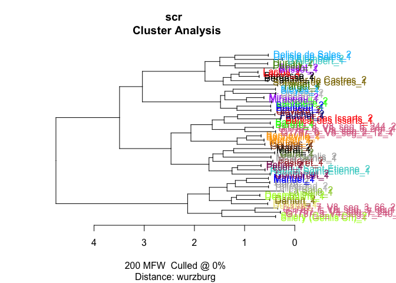
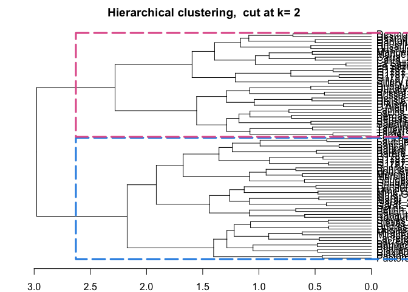
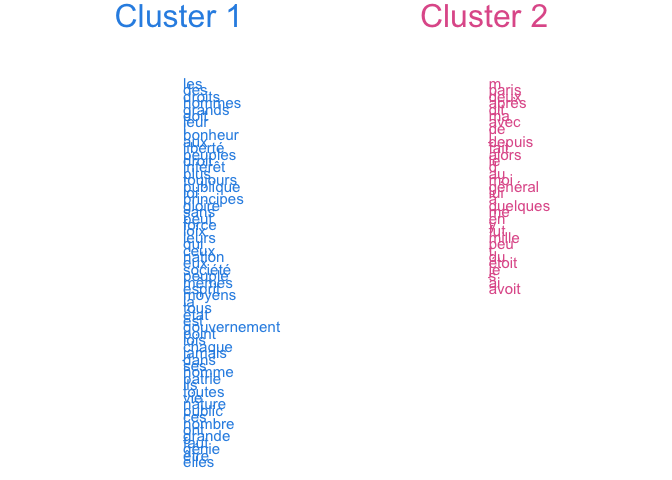
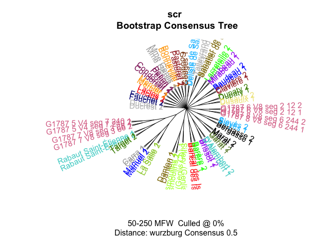
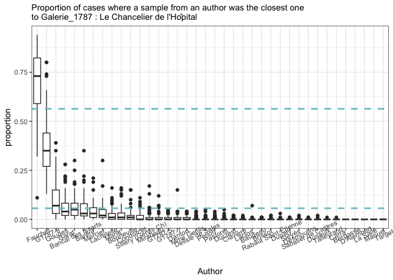
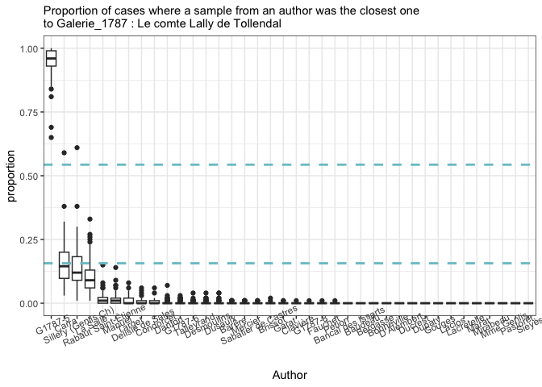

# G1787

## load pckg

``` r
library(tidyverse)
library(tidytext)
library(stringi)

library(stylo)
library(seetrees)
```

## functions

### sample independent

``` r
sample_independent_opt <- function(tokenized_df,
                                   n_samples,
                                   sample_size,
                                   text_var = "word",
                                   folder = "../corpus_sampled/",
                                   overwrite=T) {
  
  dir.create(folder)
  
  if(overwrite) {
    do.call(file.remove, list(list.files(folder, full.names = TRUE)))
    }
  
  shuff <- tokenized_df %>%
    group_by(author) %>% 
  sample_n(n_samples * sample_size) %>% # sample tokens 
  # to each sampled token assign randomly a sample number
  mutate(sample_x = sample( # sample = reshuffle the numbers of samples repeated below
    rep( # repeat
    1:n_samples, # the numbers of samples (1, 2, 3...)
    each = sample_size # each is sample_size times repeated
    ))) %>% 
  # create a column author_sampleX
  unite(sample_id, c(author, sample_x), remove = F) %>% 
  
  # group and paste together by sample_id (some kind of special paste with !!sym() )
  group_by(sample_id) %>% 
  summarise(text = paste(!!sym(text_var), collapse = " ")) 
  
  # write samples
  for(i in 1:nrow(shuff)) {
      write_file(file = paste0(folder, shuff$sample_id[i],".txt"), shuff$text[i])
  }
}   
```

### diy stylo

``` r
diy_stylo <- function(folder = "../corpus_sampled/",
                      mfw = 200,
                      drop_words = T,
                      feature = "word",
                      n_gram = 1) {
  
  # read the sampled texts from the folder corpus_sampled/
  # the feature is either word or charaters prob
  # the tokenizer returns lists of tokens for each text
  tokenized.texts = load.corpus.and.parse(
    files = list.files(folder, full.names = T),
    features = feature,
    ngram.size = n_gram
    )

  # computing a list of most frequent words (trimmed to top 2000 items):
  features = make.frequency.list(tokenized.texts, head = 2000)
  # producing a table of relative frequencies:
  data = make.table.of.frequencies(tokenized.texts, features, relative = TRUE)#[,1:mfw]
  
  # --- cleaning ---
  # remove stop words
  s_words <- str_detect(colnames(data),paste(strong_words,collapse="|"))

  if(drop_words) {
  data <- data[,!s_words]
  }
  
  # crop mfw 
  data <- data[, 1:mfw]
  
  # clean document names
  rownames(data) <- str_remove_all(rownames(data), "^.*?//") # clean rownames from full paths
  
  # output
  return(data)
}
```

## load data

``` r
fh <- list.files(path = "../corpus_cln/", 
                 full.names = T)

# corpus compilation
corpus <- tibble(
  path = fh,
  text = sapply(path, read_file)
)

# preparation for tokenisation
corpus_t <- corpus %>% 
  # remove G1785
  filter(!str_detect(path, "G1785")) %>% 
  
  # extract authors
  mutate(author = ifelse(str_detect(path, "G1787"), # keep G1785 names
                         str_extract(path, "G1787_\\d+_\\w+"),
                         # extract all others
                         str_extract(path, "corpus_cln//.*?_")), 
         # cleaning
         author = str_remove_all(author, "corpus_cln//|_$")) %>% 
  
  # remove paths for individual files
  select(-path)

str(corpus_t)
```

    tibble [138 × 2] (S3: tbl_df/tbl/data.frame)
     $ text  : Named chr [1:138] "microcopy resotution test chart nbs ansi and iso test chart french revolution research collejoton lesarchivesde"| __truncated__ "convention nationale j c s et projet de décret sur l éducation nationale prononcés a la convention nationale le"| __truncated__ "des prochaines tee t s de l an par jean henri bancal représentant du peuple à la convention nationale au consei"| __truncated__ "observations j rés entées üiu a l assemblee nationale par m parère de fieuzac député du bigorue sur la nécejfit"| __truncated__ ...
      ..- attr(*, "names")= chr [1:138] "../corpus_cln//Bancal des Issarts_1.txt" "../corpus_cln//Bancal des Issarts_3.txt" "../corpus_cln//Bancal des Issarts_5.txt" "../corpus_cln//Barère_10.txt" ...
     $ author: chr [1:138] "Bancal des Issarts" "Bancal des Issarts" "Bancal des Issarts" "Barère" ...

``` r
corpus_t %>% count(author, sort = T)
```

    # A tibble: 41 × 2
       author                  n
       <chr>               <int>
     1 Bergasse               15
     2 Baudeau                11
     3 Clavière               10
     4 Mercier                 7
     5 Desmoulins              6
     6 Epremesnil              6
     7 Barère                  5
     8 Manuel                  5
     9 Petion                  4
    10 Sillery (Genlis Ch)     4
    # ℹ 31 more rows

Tokenization

``` r
corpus_tokenized <- corpus_t %>% 
  unnest_tokens(input = text, output = word, token = "words")

sample_n(corpus_tokenized, 6)
```

    # A tibble: 6 × 2
      author   word 
      <chr>    <chr>
    1 Ducrest  le   
    2 Fauchet  voir 
    3 Sieyès   et   
    4 Danton   qui  
    5 Bergasse bien 
    6 Petion   dans 

### n words in samples

``` r
corpus_tokenized %>% 
  filter(!str_detect(author, "^G1787")) %>% 
  count(author, sort = T) %>% tail(10)
```

    # A tibble: 10 × 2
       author                   n
       <chr>                <int>
     1 Mme Genlis           27570
     2 Rabaut Saint-Étienne 26624
     3 Bancal des Issarts   24455
     4 Fauchet              22813
     5 Gouges               17063
     6 La Salle             16210
     7 Sillery (Genlis Ch)  12750
     8 Condorcet            12729
     9 Epremesnil            5874
    10 La Platière            902

``` r
corpus_tokenized %>% 
  filter(str_detect(author, "^G1787")) %>% 
  count(author, sort = F)
```

    # A tibble: 4 × 2
      author                   n
      <chr>                <int>
    1 G1787_5_V4_seg_7_240 11616
    2 G1787_6_V8_seg_2_12  11392
    3 G1787_7_V8_seg_3_66  11891
    4 G1787_8_V8_seg_6_244  8558

Remove smallest samples

``` r
corpus_tokenized <- corpus_tokenized %>% 
  # too small sample
  filter(author != "La Platière")

short_samples <- corpus_tokenized %>% 
  count(author) %>% 
  filter(n < 8000) %>% 
  pull(author)

# store shortest in a variable for easier removal later
short_samples
```

    [1] "Epremesnil"

``` r
corpus_tokenized <- corpus_tokenized %>% 
  filter(!author %in% short_samples)
```

## sampling & naive stylo

``` r
set.seed(5678)
```

``` r
sample_independent_opt(
  tokenized_df = corpus_tokenized %>% filter(!author %in% short_samples),
  sample_size = 4000, 
  n_samples = 2)
```

    Warning in dir.create(folder): '../corpus_sampled' already exists

### first clustering

``` r
test1 <- stylo(
  gui = F,
  corpus.dir = "../corpus_sampled/",
  corpus.lang = "Other",
  
  mfw.min = 200,
  mfw.max = 200,
  analyzed.features = "w",
  ngram.size = 1,
  distance.measure = "wurzburg"
)
```



#### features

``` r
test1$features.actually.used
```


    ------------------------------------------------
    features (e.g. frequent words) actually analyzed 
    ------------------------------------------------

      [1]  de            la            les           le            l             
      [6]  à            des           que           il            d             
     [11]  qui           et            qu            en            un            
     [16]  dans          est           ne            a             du            
     [21]  pour          une           n             on            ce            
     [26]  plus          par           s             pas           au            
     [31]  se            je            sur           c             son           
     [36]  vous          lui           nous          m             y             
     [41]  elle          mais          cette         ils           ses           
     [46]  si            leur          avec          ces           ou            
     [51]  tous          sa            j             aux           même         
     [56]  être         tout          t             comme         ont           
     [61]  sans          dont          leurs         peut          bien          
     [66]  fait          point         faire         où           étoit        
     [71]  toutes        me            avoit         sont          encore        
     [76]  avoir         homme         hommes        été         nos           
     [81]  deux          moins         ceux          toujours      cet           
     [86]  peuple        doit          liberté      elles         contre        
     [91]  autres        ai            grand         faut          autre         
     [96]  fut           toute         celui         après        mon           
    [101]  donc          notre         temps         dit           jamais        
    [106]  roi           france        ni            quelques      peu           
    [111]  quand         ainsi         loi           nation        là           
    [116]  tant          rien          sera          esprit        eux           
    [121]  nature        dire          celle         ordre         entre         
    [126]  droit         votre         aussi         ma            trois         
    [131]  état         pouvoir       sous          corps         jour          
    [136]  citoyens      fois          donner        non           parce         
    [141]  alors         mêmes        trop          car           enfin         
    [146]  soit          très         gouvernement  grande        loix          
    [151]  mes           mille         paris         public        lois          
    [156]  chaque        by            étoient      digitized     force         
    [161]  quelque       vos           avoient       partie        chez          
    [166]  grands        patrie        publique      depuis        général     
    [171]  premier       prince        moment        nom           vérité      
    [176]  peuples       nombre        monde         vie           ici           
    [181]  voir          mort          moi           rendre        droits        
    [186]  société     gloire        lieu          louis         bonheur       
    [191]  te            yeux          eu            ans           génie        
    [196]  principes     cela          intérêt     moyens        dieu          

    (total number of elements:  200)

#### view tree

``` r
view_tree(test1, k = 2, label_size = 4)
```





### strong words

``` r
strong_words <- c("^peuple", "^louis$", "^liberté", "^citoyen", 
                  "^nation", "^aujourd", "^je$", "^me$", "^ma$", "^j$", "^mon$",
                  "^mes$", "^lois$", "^hommes$", "^grands$", "^dont$",
                  "^paris$")
```

#### bct

``` r
# take other samples
sample_independent_opt(
  tokenized_df = corpus_tokenized, 
  n_samples = 2, 
  sample_size = 3000)

# bootstrap consensus
bct <- stylo(
  gui = F,
  corpus.dir = "../corpus_sampled/",
  corpus.lang = "Other",
  
  analyzed.features = "w",
  ngram.size = 1,
  mfw.min = 50,
  mfw.max = 250,
  mfw.incr = 1,
  distance.measure = "wurzburg",
  
  analysis.type = "BCT",
  consensus.strength = 0.5
  
)
```



# GI

## locations

``` r
data <- diy_stylo(#folder = "../corpus_sampled/",
                  mfw = 200, 
                  drop_words = T)

str(data)
```

     num [1:78, 1:200] 4.93 4.8 4.86 4.79 4.56 ...
     - attr(*, "dimnames")=List of 2
      ..$ : chr [1:78] "Bancal des Issarts_1" "Bancal des Issarts_2" "Barère_1" "Barère_2" ...
      ..$ : chr [1:200] "de" "la" "les" "le" ...

``` r
# rownames(data)

rownames(data) <- str_replace(rownames(data), "G1787_", "G1787-")

# rownames(data)

grep("G1787-5", rownames(data)) 
```

    [1] 35 36

``` r
grep("G1787-6", rownames(data))
```

    [1] 37 38

``` r
grep("G1787-7", rownames(data))
```

    [1] 39 40

``` r
grep("G1787-8", rownames(data))
```

    [1] 41 42

## G1787_5_Philippe-duc-d’Orleans

CI calculation

``` r
op_list_w <- vector(mode = "list", length = 5)

# loop for 5 runs of optimisation - THIS WILL TAKE TIME
for (i in 1:5) {
  
  # in each run we rewrite the sampling folder & grab new samples
  sample_independent_opt(
    tokenized_df = corpus_tokenized, 
    n_samples = 2, 
    sample_size = 4000)
  
  # take data from the corpus_sampled/ folder & turn it into a doc-term matrix
  data = diy_stylo(mfw = 200,
                   feature = "word",
                   n_gram = 1)
  
  
  rownames(data) <- str_replace(rownames(data), "G1787_", "G1787-")
  
  # use the data for calculation of the confidence interval and write in the list
  op_list_w[[i]] <- imposters.optimize(data[-c(35, 36), ]) # remove target
}

saveRDS(op_list_w, "exp_res/G1787-5_GI_op_list.rds")
```

``` r
op_list_w <- readRDS("exp_res/G1787-5_GI_op_list.rds")

# op_list_w[[1]][1]

# extract the first element from each list & calculate mean
min_mean_w <- map(op_list_w, 1) %>% # find the first elements
  unlist() %>% # unlist them to one vector
  mean() # calculate mean

# min_mean_w

# same for the upper border
max_mean_w <- map(op_list_w, 2) %>% 
  unlist() %>% mean()

# max_mean_w

print(paste0("The zone of 'I don't know': ", min_mean_w, " to ", max_mean_w))
```

    [1] "The zone of 'I don't know': 0.124 to 0.514"

``` r
imp_res <- vector(mode = "list", length = 100)

counter <- 0

for (i in 1:50) {
  
  # create samples for each trial
  sample_independent_opt(
    tokenized_df = corpus_tokenized, 
    n_samples = 2, 
    sample_size = 4000)
  
  # build doc-term matrix from the samples in the corpus_sampled folder
  data <- diy_stylo(mfw = 200, 
                    feature = "word",
                    n_gram = 1)
  
  rownames(data) <- str_replace(rownames(data), "G1787_", "G1787-")
  
  # test each of the true navalny sets
  for (s in c(35, 36)) {
    
    # run imposters test
    r <- imposters(reference.set = data[-c(35, 36),], # remove test data from the ref
                   test = data[c(s),], # test one of the samples against the others
                   features = 0.5, # test 50% of the features in each trial
                   iterations = 100,
                   distance = "wurzburg"
                   )
    
    # count iterations
    counter <- counter + 1
    
    # store results
    
    imp_res[[counter]] <- tibble(candidate = names(r),
                                 proportion = r)
    
    print(counter)
  }
  
}

saveRDS(imp_res, "exp_res/G1787_5_imp_res.rds")
```

``` r
# load saved data
imp_res <- readRDS("exp_res/G1787_5_imp_res.rds")

# plot
imp_res %>% 
  bind_rows() %>% #stack all the optained prop tables into one
  ggplot(aes(x = reorder(candidate, - proportion), 
             y = proportion)) + 
  geom_boxplot() + 
  theme_bw() + 
  # add horisontal lines to show the zone of uncertainty
  geom_hline(aes(yintercept = min_mean_w), 
             linewidth = 1, 
             linetype = 2, 
             color = "cadetblue3") + 
  geom_hline(aes(yintercept = max_mean_w),
             linewidth = 1,
             linetype = 2,
             color = "cadetblue3") + 
  labs(x = "Author", 
       subtitle = "Proportion of cases where a sample from an author was the closest one\nto Galerie_1787 : Philippe-duc-d'Orleans") + 
  theme(axis.text.x = element_text(angle = 25))
```


## G1787_6 Le Chancelier de l’Hôpital



## G1787_7 Le comte Lally de Tollendal

    [1] "The zone of 'I don't know': 0.156666666666667 to 0.543333333333333"



## G1787_8 Colbert

    [1] "The zone of 'I don't know': 0.163333333333333 to 0.476666666666667"


## Conclusions

-   Selected articles from the Galerie ~1787:

    -   It is likely that fragments 5 and 7 (Philippe duc d’Orleans &
        Lally de Tollendal) were written by the same author;

    -   The author of the 8th fragment (Colbert) is likely not in the
        list;

    -   There is some similarity between texts by Jean-Louis Carra and
        the fragment 5 (Philippe duc d’Orleans)

    -   There is probability that the fragment 6 (Le Chancelier de
        l’Hôpital) might have been written by abbé (Claude) Fauchet

-   Issues

    -   for some authors there are not enough data on gallica
        (e.g. Villar, Epremésnil)

    -   for the others the **choice** of the texts is difficult: 

        -   texts of different genres and, e.g., 1st / 3rd person
            narration;

        -   non-OCRed texts

        -   =\> to find a solution a more thoughtful selection of texts
            might be needed

    Solutions requiring additional work:

    -   for each target text the texts selected to as reference corpus
        might differ ;

    -   as an alternative: a more general download-all strategy,
        probably with 1st/3rd person later tagging ; 
